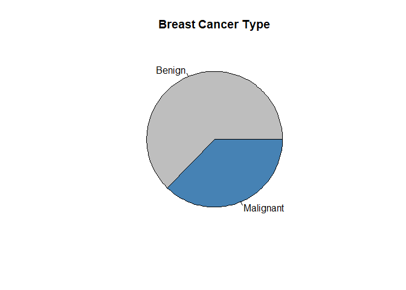

Routine breast cancer screening allows the disease to be diagnosed and
treated prior to it causing noticeable symptoms. The process of early
detection involves examining the breast tissue for abnormal lumps or
masses. If a lump is found, a fineneedle aspiration biopsy is performed,
which uses a hollow needle to extract a small sample of cells from the
mass. A clinician then examines the cells under a microscope to
determine whether the mass is likely to be malignant or benign.  
If machine learning could automate the identification of cancerous
cells, it would provide considerable benefit to the health system.
Automated processes are likely to improve the efficiency of the
detection process, allowing physicians to spend less time diagnosing and
more time treating the disease. An automated screening systemmight also
provide greater detection accuracy by removing the inherently subjective
human component from the process.

Collecting data
---------------

We will utilize the Breast Cancer Wisconsin (Diagnostic) dataset from
the UCI Machine Learning Repository at
<a href="http://archive.ics.uci.edu/ml" class="uri">http://archive.ics.uci.edu/ml</a>.
This data was donated by researchers of the University of Wisconsin and
includes measurements from digitized images of fine-needle aspirate of a
breast mass. The values represent characteristics of the cell nuclei
present in the digital image.

For individuals finding it difficult to attain the data, I have uploaded
the data on my public GitHub Repository and included the link in the
code. Just run the code and the file will be downloaded automaticall. Or
you can download it from
[here.](https://raw.githubusercontent.com/shreyaskhadse/data_files/master/wisc_bc_data.csv)
If you wish to reproduce this code and results, the code below is ready
to use as it is, just change the `path` variable, i.e. the first line of
the code to the working directory you wish and you are ready to go.

The breast cancer data includes 569 examples of cancer biopsies, each
with 32 features. One feature is an identification number, another is
the cancer diagnosis, and 30 are numeric-valued laboratory measurements.
The diagnosis is coded as `"M"` to indicate malignant or `"B"` to
indicate benign. The 30 numeric measurements comprise the mean, standard
error, and worst (that is, largest) value for 10 different
characteristics of the digitized cell nuclei. These include: - Radius  
- Textur  
- Perimeter  
- Area  
- Smoothness  
- Compactness  
- Concavity  
- Concave points  
- Symmetry  
- Fractal dimension

Based on these names, all features seem to relate to the shape and size
of the cell nuclei. Unless you are an oncologist, you are unlikely to
know how each relates to benign or malignant masses. These patterns will
be revealed as we continue in the machine learning process.

    path <- "A:/Project/Breast_Cancer"
    setwd(path)
    url <- "https://raw.githubusercontent.com/shreyaskhadse/data_files/master/wisc_bc_data.csv"
    datafile <- "./wisc_bc_data.csv"
    if (!file.exists(datafile)) {
        download.file(url, datafile ,method="auto") }

Exploring and Preparing Data
----------------------------

Let’s explore the data and see if we can shine some light on the
relationships. In doing so, we will prepare the data for use with the
k-NN learning method.

We’ll begin by importing the CSV data file as we have done in previous
chapters, saving the Wisconsin breast cancer data to the wbcd data
frame:

    wbcd <- read.csv("./wisc_bc_data.csv",stringsAsFactors = FALSE)

Using the command `str(wbcd)`, we can confirm that the data is
structured with 569 examples and 32 features, as we expected. The first
several lines of output are as follows:

    str(wbcd)

    ## 'data.frame':    569 obs. of  32 variables:
    ##  $ id               : int  87139402 8910251 905520 868871 9012568 906539 925291 87880 862989 89827 ...
    ##  $ diagnosis        : chr  "B" "B" "B" "B" ...
    ##  $ radius_mean      : num  12.3 10.6 11 11.3 15.2 ...
    ##  $ texture_mean     : num  12.4 18.9 16.8 13.4 13.2 ...
    ##  $ perimeter_mean   : num  78.8 69.3 70.9 73 97.7 ...
    ##  $ area_mean        : num  464 346 373 385 712 ...
    ##  $ smoothness_mean  : num  0.1028 0.0969 0.1077 0.1164 0.0796 ...
    ##  $ compactness_mean : num  0.0698 0.1147 0.078 0.1136 0.0693 ...
    ##  $ concavity_mean   : num  0.0399 0.0639 0.0305 0.0464 0.0339 ...
    ##  $ points_mean      : num  0.037 0.0264 0.0248 0.048 0.0266 ...
    ##  $ symmetry_mean    : num  0.196 0.192 0.171 0.177 0.172 ...
    ##  $ dimension_mean   : num  0.0595 0.0649 0.0634 0.0607 0.0554 ...
    ##  $ radius_se        : num  0.236 0.451 0.197 0.338 0.178 ...
    ##  $ texture_se       : num  0.666 1.197 1.387 1.343 0.412 ...
    ##  $ perimeter_se     : num  1.67 3.43 1.34 1.85 1.34 ...
    ##  $ area_se          : num  17.4 27.1 13.5 26.3 17.7 ...
    ##  $ smoothness_se    : num  0.00805 0.00747 0.00516 0.01127 0.00501 ...
    ##  $ compactness_se   : num  0.0118 0.03581 0.00936 0.03498 0.01485 ...
    ##  $ concavity_se     : num  0.0168 0.0335 0.0106 0.0219 0.0155 ...
    ##  $ points_se        : num  0.01241 0.01365 0.00748 0.01965 0.00915 ...
    ##  $ symmetry_se      : num  0.0192 0.035 0.0172 0.0158 0.0165 ...
    ##  $ dimension_se     : num  0.00225 0.00332 0.0022 0.00344 0.00177 ...
    ##  $ radius_worst     : num  13.5 11.9 12.4 11.9 16.2 ...
    ##  $ texture_worst    : num  15.6 22.9 26.4 15.8 15.7 ...
    ##  $ perimeter_worst  : num  87 78.3 79.9 76.5 104.5 ...
    ##  $ area_worst       : num  549 425 471 434 819 ...
    ##  $ smoothness_worst : num  0.139 0.121 0.137 0.137 0.113 ...
    ##  $ compactness_worst: num  0.127 0.252 0.148 0.182 0.174 ...
    ##  $ concavity_worst  : num  0.1242 0.1916 0.1067 0.0867 0.1362 ...
    ##  $ points_worst     : num  0.0939 0.0793 0.0743 0.0861 0.0818 ...
    ##  $ symmetry_worst   : num  0.283 0.294 0.3 0.21 0.249 ...
    ##  $ dimension_worst  : num  0.0677 0.0759 0.0788 0.0678 0.0677 ...

The first variable is an integer variable named `id`. As this is simply
a unique identifier (ID) for each patient in the data, it does not
provide useful information and we will need to exclude it from the
model.

Let’s drop the `id` feature altogether. As it is located in the first
column, we can exclude it by making a copy of the `wbcd` data frame
without column 1 and then overwriting the `wbcd` dataset:

    wbcd <- wbcd[-1]

The next variable, `diagnosis`, is of particular interest as it is the
outcome we hope to predict. This feature indicates whether the example
is from a benign or malignant mass. The `table()` output indicates that
357 masses are benign, while 212 are malignant:

    table(wbcd$diagnosis)

    ## 
    ##   B   M 
    ## 357 212

Many R machine learning classifiers require the target feature to be
coded as a factor, so we will need to recode the diagnosis variable. We
will also take this opportunity to give the `"B"` and `"M"` values more
informative labels using the `labels` parameter:

    wbcd$diagnosis <- factor(wbcd$diagnosis, levels = c("B","M"), labels = c("Benign", "Malignant"))

When we look at the `prop.table()` output, we now find that the values
have been labeled `Benign` and `Malignant`, with 62.7 percent and 37.3
percent of the masses, respectively. We also make a small pie diagram to
viasualize the distribution.

    round(prop.table(table(wbcd$diagnosis))*100, digits = 2)  

    ## 
    ##    Benign Malignant 
    ##     62.74     37.26

    slices <- c(((nrow(wbcd[wbcd$diagnosis == "Benign",]))/nrow(wbcd))*100, 
                ((nrow(wbcd[wbcd$diagnosis == "Malignant",]))/nrow(wbcd))*100)
    labs<- c("Benign", "Malignant")
    pie(slices, labels = labs, main = "Breast Cancer Type", col = c("Grey","SteelBlue"))

The remaining 30 features are all numeric and, as expected, consist of
three different measurements of 10 characteristics. For illustrative
purposes, we will only take a closer look at three of these features:

    summary(wbcd[c("radius_mean", "area_mean", "smoothness_mean")])

    ##   radius_mean       area_mean      smoothness_mean  
    ##  Min.   : 6.981   Min.   : 143.5   Min.   :0.05263  
    ##  1st Qu.:11.700   1st Qu.: 420.3   1st Qu.:0.08637  
    ##  Median :13.370   Median : 551.1   Median :0.09587  
    ##  Mean   :14.127   Mean   : 654.9   Mean   :0.09636  
    ##  3rd Qu.:15.780   3rd Qu.: 782.7   3rd Qu.:0.10530  
    ##  Max.   :28.110   Max.   :2501.0   Max.   :0.16340

Looking at the three side-by-side, do you notice anything problematic
about the values? The distance calculation for k-NN is heavily dependent
upon themeasurement scale of the input features. Since smoothness ranges
from 0.05 to 0.16, while area ranges from 143.5 to 2501.0, the impact of
area is going to be much greater than smoothness in the distance
calculation. This could potentially cause problems for our classifier,
so let’s apply normalization to rescale the features to a standard range
of values.

Trasnformation - normalizing numeric data
-----------------------------------------

To normalize these features, we need to create a `normalize()` function
in R. This function takes a vector x of numeric values, and for each
value in x, subtracts the minimum x value and divides by the range of x
values. Lastly, the resulting vector is returned. The code for the
function is as follows:

    normalize <- function(x){
        return((x-min(x))/(max(x)-min(x)))
    }

We can now apply the `normalize()` function to the numeric features in
our data frame. Rather than normalizing each of the 30 numeric variables
individually, we will use one of R’s functions to automate the process.

The `lapply()` function takes a list and applies a specified function to
each list element. As a data frame is a list of equal-length vectors, we
can use `lapply()` to apply normalize() to each feature in the data
frame. The final step is to convert the list returned by `lapply()` to a
data frame using the `as.data.frame()` function. The full process looks
like this:

    wbcd_n <- as.data.frame(lapply(wbcd[2:31], normalize))

In plain English, this command applies the normalize() function to
columns 2 to 31 in the wbcd data frame, converts the resulting list to a
data frame, and assigns it the name wbcd\_n. The \_n suffix is used here
as a reminder that the values in wbcd have been normalized.

To confirm that the transformation was applied correctly, let’s look at
some variable’s summary statistics:

    summary(wbcd_n[c("radius_mean", "area_mean", "smoothness_mean")])

    ##   radius_mean       area_mean      smoothness_mean 
    ##  Min.   :0.0000   Min.   :0.0000   Min.   :0.0000  
    ##  1st Qu.:0.2233   1st Qu.:0.1174   1st Qu.:0.3046  
    ##  Median :0.3024   Median :0.1729   Median :0.3904  
    ##  Mean   :0.3382   Mean   :0.2169   Mean   :0.3948  
    ##  3rd Qu.:0.4164   3rd Qu.:0.2711   3rd Qu.:0.4755  
    ##  Max.   :1.0000   Max.   :1.0000   Max.   :1.0000

As expected the variables, now ranges from 0 to 1.

Data preparation – creating training and test datasets
------------------------------------------------------

Although all 569 biopsies are labeled with a benign or malignant status,
it is not very interesting to predict what we already know.
Additionally, any performance measures we obtain during training may be
misleading, as we do not know the extent to which the data has been
overfitted or how well the learner will generalize to new cases. For
these reasons, a more interesting question is how well our learner
performs on a dataset of unseen data. If we had access to a laboratory,
we could apply our learner to measurements taken from the next 100
masses of unknown cancer status and see how well the machine learner’s
predictions compare to diagnoses obtained using conventional methods.

In the absence of such data, we can simulate this scenario by dividing
our data into two portions: a training dataset that will be used to
build the k-NN model and a test dataset that will be used to estimate
the predictive accuracy of the model. We will use the first 469 records
for the training dataset and the remaining 100 to simulate new
patients.  
We will split the `wbcd_n` data frame into `wbcd_train` and `wbcd_test`:

    wbcd_train <- wbcd_n[1:469,]
    wbcd_test <- wbcd_n[470:569,]

When we constructed our normalized training and test datasets, we
excluded the target variable, `diagnosis`. For training the k-NN model,
we will need to store these class labels in factor vectors, split
between the training and test datasets:

    wbcd_train_labels <- wbcd[1:469, 1]
    wbcd_test_labels <- wbcd[470:569, 1]

This code takes the `diagnosis` factor in the first column of the wbcd
data frame and creates the vectors `wbcd_train_labels` and
`wbcd_test_labels`. We will use these in the next steps of training and
evaluating our classifier.

Training a model on the data
----------------------------

Equipped with our training data and vector of labels, we are now ready
to classify our test records. For the k-NN algorithm, the training phase
actually involves no model building; the process of training a lazy
learner like k-NN simply involves storing the input data in a structured
format.

To classify our test instances, we will use a k-NN implementation from
the class package, which provides a set of basic R functions for
classification. If this package is not already installed on your system,
you can install it by typing: `install.packages("class")`. To load the
package during any session in which you wish to use the functions,
simply enter the `library(class)` command.

    #install.packages("class")
    library(class)

The knn() function in the class package provides a standard, classic
implementation of the k-NN algorithm. For each instance in the test
data, the function will identify the k nearest neighbors, using
Euclidean distance, where k is a user-specified number. The test
instance is classified by taking a “vote” among the k nearest
neighbors—specifically, this involves assigning the class of the
majority of the neighbors. A tie vote is broken at random.

Training and classification using the knn() function is performed in a
single command with four parameters.

We now have nearly everything we need to apply the k-NN algorithm to
this data. We’ve split our data into training and test datasets, each
with exactly the same numeric features. The labels for the training data
are stored in a separate factor vector. The only remaining parameter is
`k`, which specifies the number of neighbors to include in the vote.

As our training data includes 469 instances, we might try `k = 21`, an
odd number roughly equal to the square root of 469. With a two-category
outcome, using an odd number eliminates the chance of ending with a tie
vote.

Now we can use the `knn()` function to classify the test data:

    wbcd_test_pred <- knn(train = wbcd_train, test = wbcd_test, cl= wbcd_train_labels, k =21)

The `knn()` function returns a factor vector of predicted labels for
each of the examples in the `wbcd_test dataset`. We have assigned these
predictions to `wbcd_test_pred`.

Evaluating model performance
----------------------------

The next step of the process is to evaluate how well the predicted
classes in the `wbcd_test_pred` vector match the actual values in the
wbcd\_test\_labels vector. To do this, we can use the `CrossTable()`
function in the gmodels package.

After loading the package with the `library(gmodels)` command, we can
create a cross tabulation indicating the agreement between the predicted
and actual label vectors. Specifying `prop.chisq = FALSE` will remove
the unnecessary chi-square values from the output:

    #install.packages("gmodels")
    library("gmodels")

    ## Warning: package 'gmodels' was built under R version 3.6.3

    CrossTable(x = wbcd_test_labels, y = wbcd_test_pred, prop.chisq = FALSE)

    ## 
    ##  
    ##    Cell Contents
    ## |-------------------------|
    ## |                       N |
    ## |           N / Row Total |
    ## |           N / Col Total |
    ## |         N / Table Total |
    ## |-------------------------|
    ## 
    ##  
    ## Total Observations in Table:  100 
    ## 
    ##  
    ##                  | wbcd_test_pred 
    ## wbcd_test_labels |    Benign | Malignant | Row Total | 
    ## -----------------|-----------|-----------|-----------|
    ##           Benign |        61 |         0 |        61 | 
    ##                  |     1.000 |     0.000 |     0.610 | 
    ##                  |     0.968 |     0.000 |           | 
    ##                  |     0.610 |     0.000 |           | 
    ## -----------------|-----------|-----------|-----------|
    ##        Malignant |         2 |        37 |        39 | 
    ##                  |     0.051 |     0.949 |     0.390 | 
    ##                  |     0.032 |     1.000 |           | 
    ##                  |     0.020 |     0.370 |           | 
    ## -----------------|-----------|-----------|-----------|
    ##     Column Total |        63 |        37 |       100 | 
    ##                  |     0.630 |     0.370 |           | 
    ## -----------------|-----------|-----------|-----------|
    ## 
    ## 

The cell percentages in the table indicate the proportion of values that
fall into four categories. The top-left cell indicates the true negative
results. These 61 of 100 values are cases where the mass was benign and
the k-NN algorithm correctly identified it as such. The bottom-right
cell indicates the true positive results, where the classifier and the
clinically determined label agree that the mass is malignant. A total of
37 of 100 predictions were true positives.

The cells falling on the other diagonal contain counts of examples where
the k-NN prediction disagreed with the true label. The two examples in
the lower-left cell are false negative results; in this case, the
predicted value was benign, but the tumor was actually malignant. Errors
in this direction could be extremely costly, as they might lead a
patient to believe that she is cancer-free, but in reality, the disease
may continue to spread.

The top-right cell would contain the false positive results, if there
were any. These values occur when the model has classified a mass as
malignant when in reality it was benign. Although such errors are less
dangerous than a false negative result, they should also be avoided, as
they could lead to additional financial burden on the health care system
or stress for the patient, as unnecessary tests or treatment may be
provided.

A total of 2 out of 100, or 2 percent of masses were incorrectly
classified by the k-NN approach. While 98 percent accuracy seems
impressive for a few lines of R code, we might try another iteration of
the model to see if we can improve the performance and reduce the number
of values that have been incorrectly classified, especially because the
errors were dangerous false negatives.

Transformation z-score standardization
--------------------------------------

We will attempt to improve the model performance. We will employ an
alternative method for rescaling our numeric features.

Although normalization is commonly used for k-NN classification, z-score
standardization may be a more appropriate way to rescale the features in
a cancer dataset. Since z-score standardized values have no predefined
minimum and maximum, extreme values are not compressed towards the
center. Even in the absence of formal medical-domain training, one might
suspect that a malignant tumor might lead to extreme outliers as tumors
grow uncontrollably. With this in mind, it might be reasonable to allow
the outliers to be weighted more heavily in the distance calculation.
Let’s see whether z-score standardization improves our predictive
accuracy.

To standardize a vector, we can use R’s built-in `scale()` function,
which by default rescales values using the z-score standardization. The
`scale()` function can be applied directly to a data frame, so there is
no need to use the `lapply()` function. To create a z-score standardized
version of the `wbcd` data, we can use the following command:

    wbcd_z <- as.data.frame(scale(wbcd[-1]))

This rescales all features with the exception of diagnosis in the first
column and stores the result as the `wbcd_z` data frame. The `_z` suffix
is a reminder that the values were z-score transformed. To confirm that
the transformation was applied correctly, we can look at the summary
statistics:

    summary(wbcd_z[c("radius_mean", "area_mean", "smoothness_mean")])

    ##   radius_mean        area_mean       smoothness_mean   
    ##  Min.   :-2.0279   Min.   :-1.4532   Min.   :-3.10935  
    ##  1st Qu.:-0.6888   1st Qu.:-0.6666   1st Qu.:-0.71034  
    ##  Median :-0.2149   Median :-0.2949   Median :-0.03486  
    ##  Mean   : 0.0000   Mean   : 0.0000   Mean   : 0.00000  
    ##  3rd Qu.: 0.4690   3rd Qu.: 0.3632   3rd Qu.: 0.63564  
    ##  Max.   : 3.9678   Max.   : 5.2459   Max.   : 4.76672

The mean of a z-score standardized variable should always be zero, and
the range should be fairly compact. A z-score greater than 3 or less
than -3 indicates an extremely rare value. Examining the summary
statistics with these criteria in mind, the transformation seems to have
worked.

As we have done before, we need to divide the z-score-transformed data
into training and test sets, and classify the test instances using the
`knn()` function. We’ll then compare the predicted labels to the actual
labels using `CrossTable()`:

    wbcd_train_z <- wbcd_z[1:469,]
    wbcd_test_z <- wbcd_n[470:569,]
    wbcd_train_labels_z <- wbcd[1:469, 1]
    wbcd_test_labels_z <- wbcd[470:569, 1]
    wbcd_test_pred_z <- knn(train = wbcd_train_z, test = wbcd_test_z, cl= wbcd_train_labels_z, k =21)
    CrossTable(x = wbcd_test_labels_z, y = wbcd_test_pred_z, prop.chisq = FALSE)

    ## 
    ##  
    ##    Cell Contents
    ## |-------------------------|
    ## |                       N |
    ## |           N / Row Total |
    ## |           N / Col Total |
    ## |         N / Table Total |
    ## |-------------------------|
    ## 
    ##  
    ## Total Observations in Table:  100 
    ## 
    ##  
    ##                    | wbcd_test_pred_z 
    ## wbcd_test_labels_z |    Benign | Malignant | Row Total | 
    ## -------------------|-----------|-----------|-----------|
    ##             Benign |        14 |        47 |        61 | 
    ##                    |     0.230 |     0.770 |     0.610 | 
    ##                    |     1.000 |     0.547 |           | 
    ##                    |     0.140 |     0.470 |           | 
    ## -------------------|-----------|-----------|-----------|
    ##          Malignant |         0 |        39 |        39 | 
    ##                    |     0.000 |     1.000 |     0.390 | 
    ##                    |     0.000 |     0.453 |           | 
    ##                    |     0.000 |     0.390 |           | 
    ## -------------------|-----------|-----------|-----------|
    ##       Column Total |        14 |        86 |       100 | 
    ##                    |     0.140 |     0.860 |           | 
    ## -------------------|-----------|-----------|-----------|
    ## 
    ## 

Unfortunately, in the following table, the results of our new
transformation show a slight decline in accuracy. Using the same
instances in which we had previously classified 98 percent of examples
correctly, we now classified only 53 percent correctly. Making matters
worse, we did no better at classifying the dangerous false negatives.

Attempts to increase the effeciency by varying the values of `k` were
made but the highest accuracy was 98% which is with `k = 21` the same
value that we used.

Summary
-------

Unlike many classification algorithms, k-nearest neighbors does not do
any learning. It simply stores the training data verbatim. Unlabeled
test examples are then matched to the most similar records in the
training set using a distance function, and the unlabeled example is
assigned the label of its neighbors.

In spite of the fact that k-NN is a very simple algorithm, it is capable
of tackling extremely complex tasks such as the identification of
cancerous masses. In a few simple lines of R code, we were able to
correctly identify whether a mass was malignant or benign 98 percent of
the time.
