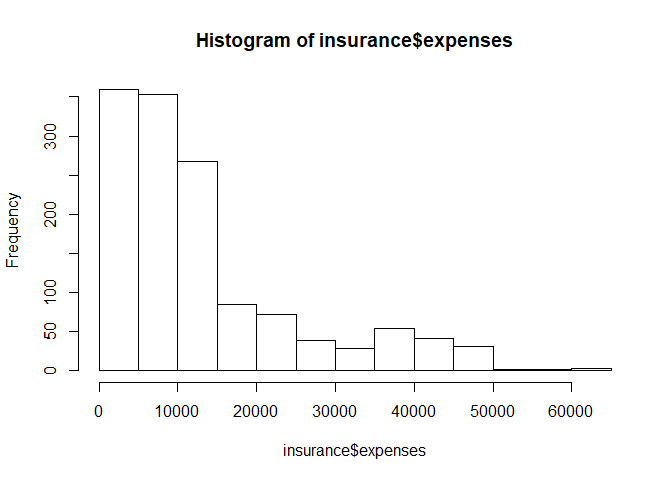
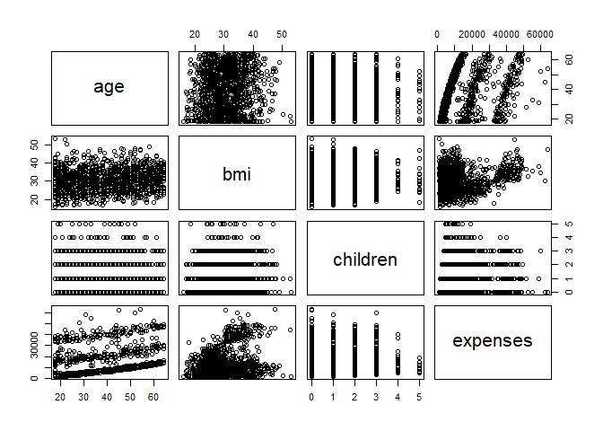
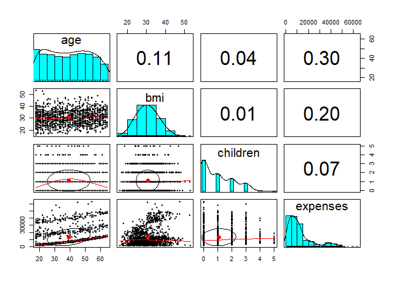
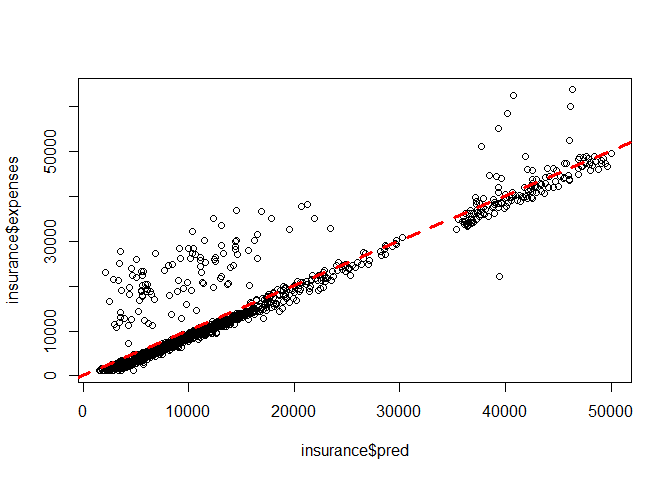

Introduction
------------

In order for a health insurance company to make money, it needs to
collect more in yearly premiums than it spends on medical care to its
beneficiaries. Consequently, insurers invest a great deal of time and
money to develop models that accurately forecast medical expenses for
the insured population.

Medical expenses are difficult to estimate because the costliest
conditions are rare and seemingly random. Still, some conditions are
more prevalent for certain segments of the population. For instance,
lung cancer is more likely among smokers than non-smokers, and heart
disease may be more likely among the obese.

The goal of this analysis is to use patient data to forecast the average
medical care expenses for such population segments. These estimates
could be used to create actuarial tables that set the price of yearly
premiums higher or lower according to the expected treatment costs.

Collecting data
---------------

For this analysis, we will use a simulated dataset containing
hypothetical medical expenses for patients in the United States. This
data was created for this book using demographic statistics from the US
Census Bureau, and thus, approximately reflect real-world conditions.

For ease to acces the dataset I have hosted a public repository and
included the code that directly downloads the data from the repo and
loads the data. The path can be canged to anythig according to your
preference of the working directory.

    path <- "A:/Project/Medical_Expenses"
    setwd(path)
    url <- "https://raw.githubusercontent.com/shreyaskhadse/data_files/master/insurance.csv"
    datafile <- "./insurance.csv"
    if (!file.exists(datafile)) {
        download.file(url, datafile ,method="auto") }
    insurance <- read.csv("insurance.csv")
    colnames(insurance) <- c("age","sex","bmi","children","smoker","region","expenses")
    str(insurance)

    ## 'data.frame':    1338 obs. of  7 variables:
    ##  $ age     : int  19 18 28 33 32 31 46 37 37 60 ...
    ##  $ sex     : Factor w/ 2 levels "female","male": 1 2 2 2 2 1 1 1 2 1 ...
    ##  $ bmi     : num  27.9 33.8 33 22.7 28.9 ...
    ##  $ children: int  0 1 3 0 0 0 1 3 2 0 ...
    ##  $ smoker  : Factor w/ 2 levels "no","yes": 2 1 1 1 1 1 1 1 1 1 ...
    ##  $ region  : Factor w/ 4 levels "northeast","northwest",..: 4 3 3 2 2 3 3 2 1 2 ...
    ##  $ expenses: num  16885 1726 4449 21984 3867 ...

The `insurance.csv` file includes 1,338 examples of beneficiaries
currently enrolled in the insurance plan, with features indicating
characteristics of the patient as well as the total medical expenses
charged to the plan for the calendar year. The features are:

• `age`: An integer indicating the age of the primary beneficiary
(excluding those above 64 years, as they are generally covered by the
government).

• `sex`: The policy holder’s gender: either male or female.

• `bmi`: The body mass index (BMI), which provides a sense of how over
or underweight a person is relative to their height. BMI is equal to
weight (in kilograms) divided by height (in meters) squared. An ideal
BMI is within the range of 18.5 to 24.9.

• `children`: An integer indicating the number of children/dependents
covered by the insurance plan.

• `smoker`: A yes or no categorical variable that indicates whether the
insured regularly smokes tobacco.

• `region`: The beneficiary’s place of residence in the US, divided into
four geographic regions: northeast, southeast, southwest, or northwest.

Our model’s dependent variable is expenses, which measures the medical
costs each person charged to the insurance plan for the year. Prior to
building a regression model, it is often helpful to check for normality.
Although linear regression does not strictly require a normally
distributed dependent variable, the model often fits better when this is
true. Let’s take a look at the summary statistics:

    summary(insurance$expenses)

    ##    Min. 1st Qu.  Median    Mean 3rd Qu.    Max. 
    ##    1122    4740    9382   13270   16640   63770

Because the mean value is greater than the median, this implies that the
distribution of insurance expenses is right-skewed. We can confirm this
visually using a histogram:

    hist(insurance$expenses)

As expected, the figure shows a right-skewed distribution. It also shows
that the majority of people in our data have yearly medical expenses
between zero and $15,000, in spite of the fact that the tail of the
distribution extends far past these peaks. Although this distribution is
not ideal for a linear regression, knowing this weakness ahead of time
may help us design a better-fitting model later on.

Before we address that issue, another problem is at hand. Regression
models require that every feature is numeric, yet we have three
factor-type features in our data frame. For instance, the `sex` variable
is divided into `male` and `female levels`, while `smoker` has
categories for `yes` and `no`. From the `summary()` output, we know that
`region` has four levels, but we need to take a closer look to see how
they are distributed:

    table(insurance$region)

    ## 
    ## northeast northwest southeast southwest 
    ##       324       325       364       325

Here, we see that the data has been divided nearly evenly among four
geographic regions.

### Exploring relationships among features – the correlation matrix

Before fitting a regression model to data, it can be useful to determine
how the independent variables are related to the dependent variable and
each other. A correlation matrix provides a quick overview of these
relationships. Given a set of variables, it provides a correlation for
each pairwise relationship.

To create a correlation matrix for the four numeric variables in the
`insurance` data frame, use the `cor()` command:

    cor(insurance[c("age", "bmi", "children", "expenses")])

    ##                age       bmi   children   expenses
    ## age      1.0000000 0.1092719 0.04246900 0.29900819
    ## bmi      0.1092719 1.0000000 0.01275890 0.19834097
    ## children 0.0424690 0.0127589 1.00000000 0.06799823
    ## expenses 0.2990082 0.1983410 0.06799823 1.00000000

None of the correlations in the matrix are very strong, but there are
some notable associations. For instance, `age` and `bmi` appear to have
a weak positive correlation, meaning that as someone ages, their body
mass tends to increase. There are also positive correlations between
`age` and `expenses`, bmi and `expenses`, and `children` and `expenses`.
These associations imply that as age, body mass, and number of children
increase, the expected cost of insurance goes up

### Visualizing relationships among features – the scatterplot matrix

It can also be helpful to visualize the relationships among numeric
features with scatterplots. Although we could create a scatterplot for
each possible relationship, doing so for a large number of features
quickly becomes tedious.

    pairs(insurance[c("age", "bmi", "children", "expenses")])

Although some look like random cloudsof points, a few seem to display
some trends. The relationship between age and expenses displays several
relatively straight lines, while the bmi versus expenses plot has two
distinct groups of points. It is difficult to detect trends in any of
the other plots.

An enhanced scatterplot matrix can be created with the `pairs.panels()`
function in the `psych` package.

    if(!require(psych)) install.packages("psych",repos = "http://cran.us.r-project.org")

    ## Loading required package: psych

    pairs.panels(insurance[c("age", "bmi", "children", "expenses")])

The oval-shaped object on each scatterplot is a correlation ellipse. It
provides a visualization of correlation strength. The more the ellipse
is stretched, the stronger the correlation. An almost perfectly round
oval, as with `bmi` and `children`, indicates a very weak correlation
(in this case 0.01).

The ellipse for `age` and `expenses` in much more stretched, reflecting
its stronger correlation (0.30). The dot at the center of the ellipse is
a point reflecting the means of the x axis and y axis variables.

The curve drawn on the scatterplot is called a loess curve. It indicates
the general relationship between the x axis and y axis variables.The
curve for `age` and `children` is an upside-down U, peaking around
middle age. This means that the oldest and youngest people in the sample
have fewer children on the insurance plan than those around middle age.
Because this trend is nonlinear, this finding could not have been
inferred from the correlations alone. On the other hand, the loess curve
for `age` and `bmi` is a line sloping up gradually, implying that body
mass increases with `age`, but we had already inferred this from the
correlation matrix.

Training a model on the data
----------------------------

    ins_model <- lm(expenses ~ ., data = insurance)
    ins_model

    ## 
    ## Call:
    ## lm(formula = expenses ~ ., data = insurance)
    ## 
    ## Coefficients:
    ##     (Intercept)              age          sexmale              bmi  
    ##        -11938.5            256.9           -131.3            339.2  
    ##        children        smokeryes  regionnorthwest  regionsoutheast  
    ##           475.5          23848.5           -353.0          -1035.0  
    ## regionsouthwest  
    ##          -960.1

The beta coefficients indicate the estimated increase in expenses for an
increase of one unit in each of the features, assuming all other values
are held constant. For instance, for each additional year of age, we
would expect $256.90 higher medical expenses on average, assuming
everything else is held equal.

the sex feature has two categories: male and female. This will be split
into two binary variables, which R names `sexmale` and `sexfemale`. For
observations where `sex` = male, then `sexmale` = 1 and `sexfemale` = 0;
conversely, if `sex` = female, then `sexmale` = 0 and `sexfemale` = 1.
The same coding applies to variables with three or more categories. For
example, R split the four-category feature region into four dummy
variables: `regionnorthwest, regionsoutheast, regionsouthwest`, and
`regionnortheast`.

Evaluating model performance
----------------------------

    summary(ins_model)

    ## 
    ## Call:
    ## lm(formula = expenses ~ ., data = insurance)
    ## 
    ## Residuals:
    ##      Min       1Q   Median       3Q      Max 
    ## -11304.9  -2848.1   -982.1   1393.9  29992.8 
    ## 
    ## Coefficients:
    ##                 Estimate Std. Error t value Pr(>|t|)    
    ## (Intercept)     -11938.5      987.8 -12.086  < 2e-16 ***
    ## age                256.9       11.9  21.587  < 2e-16 ***
    ## sexmale           -131.3      332.9  -0.394 0.693348    
    ## bmi                339.2       28.6  11.860  < 2e-16 ***
    ## children           475.5      137.8   3.451 0.000577 ***
    ## smokeryes        23848.5      413.1  57.723  < 2e-16 ***
    ## regionnorthwest   -353.0      476.3  -0.741 0.458769    
    ## regionsoutheast  -1035.0      478.7  -2.162 0.030782 *  
    ## regionsouthwest   -960.0      477.9  -2.009 0.044765 *  
    ## ---
    ## Signif. codes:  0 '***' 0.001 '**' 0.01 '*' 0.05 '.' 0.1 ' ' 1
    ## 
    ## Residual standard error: 6062 on 1329 degrees of freedom
    ## Multiple R-squared:  0.7509, Adjusted R-squared:  0.7494 
    ## F-statistic: 500.8 on 8 and 1329 DF,  p-value: < 2.2e-16

our model is performing fairly well. It is not uncommon for regression
models of real-world data to have fairly low R-squared values; a value
of 0.75 is actually quite good. The size of some of the errors is a bit
concerning, but not surprising given the nature of medical expense data.
However, as shown in the next section, we may be able to improve the
model’s performance by specifying the model in a slightly different way.

Improving model performance
---------------------------

Based on a bit of subject matter knowledge of how medical costs may be
related to patient characteristics, we developed what we think is a more
accurately specified regression formula. To summarize the improvements,
we:

• Added a nonlinear term for age

• Created an indicator for obesity

• Specified an interaction between obesity and smoking

    insurance$age2 <- insurance$age^2
    insurance$bmi30 <- ifelse(insurance$bmi >= 30, 1, 0)
    ins_model2 <- lm(expenses ~ age + age2 + children + bmi + sex + bmi30*smoker + region, data = insurance)
    summary(ins_model2)

    ## 
    ## Call:
    ## lm(formula = expenses ~ age + age2 + children + bmi + sex + bmi30 * 
    ##     smoker + region, data = insurance)
    ## 
    ## Residuals:
    ##      Min       1Q   Median       3Q      Max 
    ## -17296.4  -1656.0  -1263.3   -722.1  24160.2 
    ## 
    ## Coefficients:
    ##                   Estimate Std. Error t value Pr(>|t|)    
    ## (Intercept)       134.2509  1362.7511   0.099 0.921539    
    ## age               -32.6851    59.8242  -0.546 0.584915    
    ## age2                3.7316     0.7463   5.000 6.50e-07 ***
    ## children          678.5612   105.8831   6.409 2.04e-10 ***
    ## bmi               120.0196    34.2660   3.503 0.000476 ***
    ## sexmale          -496.8245   244.3659  -2.033 0.042240 *  
    ## bmi30           -1000.1403   422.8402  -2.365 0.018159 *  
    ## smokeryes       13404.6866   439.9491  30.469  < 2e-16 ***
    ## regionnorthwest  -279.2038   349.2746  -0.799 0.424212    
    ## regionsoutheast  -828.5467   351.6352  -2.356 0.018604 *  
    ## regionsouthwest -1222.6437   350.5285  -3.488 0.000503 ***
    ## bmi30:smokeryes 19810.7533   604.6567  32.764  < 2e-16 ***
    ## ---
    ## Signif. codes:  0 '***' 0.001 '**' 0.01 '*' 0.05 '.' 0.1 ' ' 1
    ## 
    ## Residual standard error: 4445 on 1326 degrees of freedom
    ## Multiple R-squared:  0.8664, Adjusted R-squared:  0.8653 
    ## F-statistic: 781.7 on 11 and 1326 DF,  p-value: < 2.2e-16

The model fit statistics help to determine whether our changes improved
the performance of the regression model. Relative to our first model,
the R-squared value has improved from 0.75 to about 0.87.

Our model is now explaining 87 percent of the variation in medical
treatment costs. Additionally, our theories about the model’s functional
form seem to be validated. The higher-order age2 term is statistically
significant, as is the obesity indicator, bmi30.

Making predictions with a regression model
------------------------------------------

    insurance$pred <- predict(ins_model2, insurance)
    cor(insurance$pred, insurance$expenses)

    ## [1] 0.9308031

The correlation of 0.93 suggests a very strong linear relationship
between the predicted and actual values. This is a good sign—it suggests
that the model is highly accurate!

    plot(insurance$pred, insurance$expenses)
    abline(a = 0, b = 1, col = "red", lwd = 3, lty = 2)

    predict(ins_model2, data.frame(age = 30, age2 = 30^2, children = 2, bmi = 30, sex = "male", bmi30 = 1, smoker = "no", region = "northeast"))

    ##        1 
    ## 5972.859

Using this value, the insurance company might need to set its prices to
about $6,000 per year, or $500 per month in order to break even for this
demographic group.

    predict(ins_model2, data.frame(age = 30, age2 = 30^2, children = 2, bmi = 30, sex = "female", bmi30 = 1, smoker = "no", region = "northeast"))

    ##        1 
    ## 6469.683

Note that the difference between these two values, 5972.859 - 6469.683 =
-496.824, is the same as the estimated regression model coefficient for
`sexmale`. On average, males are estimated to have about $496 less in
expenses for the plan per year, all else being equal.
