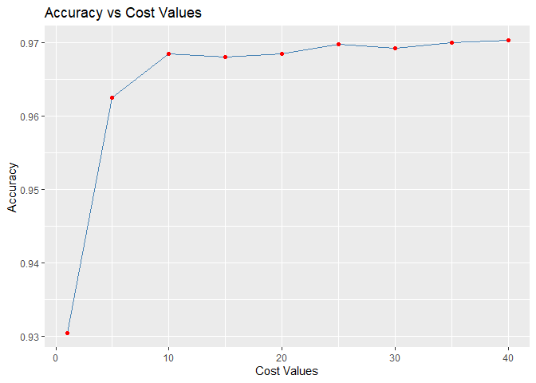

Introduction
------------

Image processing is a difficult task for many types of machine learning
algorithms. The relationships linking patterns of pixels to higher
concepts are extremely complex and hard to define. For instance, it’s
easy for a human being to recognize a face, a cat, or the letter “A”,
but defining these patterns in strict rules is difficult. Furthermore,
image data is often noisy. There can be many slight variations in how
the image was captured depending on the lighting, orientation, and
positioning of the subject.

SVMs are well suited to tackle the challenges of image data. Capable of
learning complex patterns without being overly sensitive to noise, they
are able to recognize visual patterns with a high degree of accuracy.

We will develop a model similar to those used at the core of the optical
character recognition (OCR) software often bundled with desktop document
scanners or in smartphone applications. The purpose of such software is
to process paper-based documents by converting printed or handwritten
text into an electronic form to be saved in a database.

Collecting data
---------------

When OCR software first processes a document, it divides the paper into
a matrix such that each cell in the grid contains a single glyph, which
is a term referring to a letter, symbol, or number. Next, for each cell,
the software will attempt to match the glyph to a set of all characters
it recognizes. Finally, the individual characters can be combined into
words, which optionally could be spell-checked against a dictionary in
the document’s language.

We’ll assume that we have already developed the algorithm to partition
the document into rectangular regions each consisting of a single glyph.
We will also assume the document contains only alphabetic characters in
English. Therefore, we’ll simulate a process that involves matching
glyphs to one of the 26 letters, A to Z.

We’ll use a dataset donated to the UCI Machine Learning Repository
(<a href="http://archive.ics.uci.edu/ml" class="uri">http://archive.ics.uci.edu/ml</a>)
by W. Frey and D. J. Slate. The dataset contains 20,000 examples of 26
English alphabet capital letters as printed using 20 different randomly
reshaped and distorted black-and-white fonts.

The following figure, published by Frey and Slate, provides an example
of some of the printed glyphs. Distorted in this way, the letters are
challenging for a computer to identify, yet are easily recognized by a
human being:

For ease to acces the dataset I have hosted a public repository and
included the code that directly downloads the data from the repo and
loads the data. The path can be canged to anythig according to your
preference of the working directory.

    set.seed(12345)
    path <- "A:/Project/OCR"
    setwd(path)
    url <- "https://raw.githubusercontent.com/shreyaskhadse/data_files/master/letterdata.csv"
    datafile <- "./letterdata.csv"
    if (!file.exists(datafile)) {
        download.file(url, datafile ,method="auto") }
    letters <- read.csv("letterdata.csv")

Exploring and preparing data
----------------------------

When the glyphs are scanned into the computer, they are converted into
pixels and 16 statistical attributes are recorded.

The attributes measure such characteristics as the horizontal and
vertical dimensions of the glyph; the proportion of black (versus white)
pixels; and the average horizontal and vertical position of the pixels.
Presumably, differences in the concentration of black pixels across
various areas of the box should provide a way to differentiate among the
26 letters of the alphabet.

    str(letters)

    ## 'data.frame':    20000 obs. of  17 variables:
    ##  $ letter: Factor w/ 26 levels "A","B","C","D",..: 20 9 4 14 7 19 2 1 10 13 ...
    ##  $ xbox  : int  2 5 4 7 2 4 4 1 2 11 ...
    ##  $ ybox  : int  8 12 11 11 1 11 2 1 2 15 ...
    ##  $ width : int  3 3 6 6 3 5 5 3 4 13 ...
    ##  $ height: int  5 7 8 6 1 8 4 2 4 9 ...
    ##  $ onpix : int  1 2 6 3 1 3 4 1 2 7 ...
    ##  $ xbar  : int  8 10 10 5 8 8 8 8 10 13 ...
    ##  $ ybar  : int  13 5 6 9 6 8 7 2 6 2 ...
    ##  $ x2bar : int  0 5 2 4 6 6 6 2 2 6 ...
    ##  $ y2bar : int  6 4 6 6 6 9 6 2 6 2 ...
    ##  $ xybar : int  6 13 10 4 6 5 7 8 12 12 ...
    ##  $ x2ybar: int  10 3 3 4 5 6 6 2 4 1 ...
    ##  $ xy2bar: int  8 9 7 10 9 6 6 8 8 9 ...
    ##  $ xedge : int  0 2 3 6 1 0 2 1 1 8 ...
    ##  $ xedgey: int  8 8 7 10 7 8 8 6 6 1 ...
    ##  $ yedge : int  0 4 3 2 5 9 7 2 1 1 ...
    ##  $ yedgex: int  8 10 9 8 10 7 10 7 7 8 ...

SVM learners require all features to be numeric, and moreover, that each
feature is scaled to a fairly small interval. In this case, every
feature is an integer, so we do not need to convert any factors into
numbers. On the other hand, some of the ranges for these integer
variables appear fairly wide. This indicates that we need to normalize
or standardize the data. The R package that we will use for fitting the
SVM model will perform the rescaling automatically.

We now split the data into a 80:20 train-test dataset.

    letters_train <- letters[1:16000, ]
    letters_test <- letters[16001:20000, ]

Training a model on the data
----------------------------

The `e1071` package from the Department of Statistics at the Vienna
University of Technology (TU Wien) provides an R interface to the
award-winning `LIBSVM` library, a widely used open-source SVM program
written in C++.

`SVMlight` algorithm, the `klaR` package from the Department of
Statistics at the Dortmund University of Technology (TU Dortmund)
provides functions to work with this SVM implementation directly from R.

It is perhaps best to begin with the SVM functions in the `kernlab`
package. An interesting advantage of this package is that it was
developed natively in R rather than C or C++, which allows it to be
easily customized; none of the internals are hidden behind the scenes.
Perhaps even more importantly, unlike the other options, `kernlab` can
be used with the `caret` package, which allows SVM models to be trained
and evaluated using a variety of automated methods.

    #install.packages("kernlab")
    library(kernlab)
    letter_classifier <- ksvm(letter ~ ., data = letters_train, kernel = "vanilladot")

    ##  Setting default kernel parameters

    letter_classifier

    ## Support Vector Machine object of class "ksvm" 
    ## 
    ## SV type: C-svc  (classification) 
    ##  parameter : cost C = 1 
    ## 
    ## Linear (vanilla) kernel function. 
    ## 
    ## Number of Support Vectors : 7037 
    ## 
    ## Objective Function Value : -14.1746 -20.0072 -23.5628 -6.2009 -7.5524 -32.7694 -49.9786 -18.1824 -62.1111 -32.7284 -16.2209 -32.2837 -28.9777 -51.2195 -13.276 -35.6217 -30.8612 -16.5256 -14.6811 -32.7475 -30.3219 -7.7956 -11.8138 -32.3463 -13.1262 -9.2692 -153.1654 -52.9678 -76.7744 -119.2067 -165.4437 -54.6237 -41.9809 -67.2688 -25.1959 -27.6371 -26.4102 -35.5583 -41.2597 -122.164 -187.9178 -222.0856 -21.4765 -10.3752 -56.3684 -12.2277 -49.4899 -9.3372 -19.2092 -11.1776 -100.2186 -29.1397 -238.0516 -77.1985 -8.3339 -4.5308 -139.8534 -80.8854 -20.3642 -13.0245 -82.5151 -14.5032 -26.7509 -18.5713 -23.9511 -27.3034 -53.2731 -11.4773 -5.12 -13.9504 -4.4982 -3.5755 -8.4914 -40.9716 -49.8182 -190.0269 -43.8594 -44.8667 -45.2596 -13.5561 -17.7664 -87.4105 -107.1056 -37.0245 -30.7133 -112.3218 -32.9619 -27.2971 -35.5836 -17.8586 -5.1391 -43.4094 -7.7843 -16.6785 -58.5103 -159.9936 -49.0782 -37.8426 -32.8002 -74.5249 -133.3423 -11.1638 -5.3575 -12.438 -30.9907 -141.6924 -54.2953 -179.0114 -99.8896 -10.288 -15.1553 -3.7815 -67.6123 -7.696 -88.9304 -47.6448 -94.3718 -70.2733 -71.5057 -21.7854 -12.7657 -7.4383 -23.502 -13.1055 -239.9708 -30.4193 -25.2113 -136.2795 -140.9565 -9.8122 -34.4584 -6.3039 -60.8421 -66.5793 -27.2816 -214.3225 -34.7796 -16.7631 -135.7821 -160.6279 -45.2949 -25.1023 -144.9059 -82.2352 -327.7154 -142.0613 -158.8821 -32.2181 -32.8887 -52.9641 -25.4937 -47.9936 -6.8991 -9.7293 -36.436 -70.3907 -187.7611 -46.9371 -89.8103 -143.4213 -624.3645 -119.2204 -145.4435 -327.7748 -33.3255 -64.0607 -145.4831 -116.5903 -36.2977 -66.3762 -44.8248 -7.5088 -217.9246 -12.9699 -30.504 -2.0369 -6.126 -14.4448 -21.6337 -57.3084 -20.6915 -184.3625 -20.1052 -4.1484 -4.5344 -0.828 -121.4411 -7.9486 -58.5604 -21.4878 -13.5476 -5.646 -15.629 -28.9576 -20.5959 -76.7111 -27.0119 -94.7101 -15.1713 -10.0222 -7.6394 -1.5784 -87.6952 -6.2239 -99.3711 -101.0906 -45.6639 -24.0725 -61.7702 -24.1583 -52.2368 -234.3264 -39.9749 -48.8556 -34.1464 -20.9664 -11.4525 -123.0277 -6.4903 -5.1865 -8.8016 -9.4618 -21.7742 -24.2361 -123.3984 -31.4404 -88.3901 -30.0924 -13.8198 -9.2701 -3.0823 -87.9624 -6.3845 -13.968 -65.0702 -105.523 -13.7403 -13.7625 -50.4223 -2.933 -8.4289 -80.3381 -36.4147 -112.7485 -4.1711 -7.8989 -1.2676 -90.8037 -21.4919 -7.2235 -47.9557 -3.383 -20.433 -64.6138 -45.5781 -56.1309 -6.1345 -18.6307 -2.374 -72.2553 -111.1885 -106.7664 -23.1323 -19.3765 -54.9819 -34.2953 -64.4756 -20.4115 -6.689 -4.378 -59.141 -34.2468 -58.1509 -33.8665 -10.6902 -53.1387 -13.7478 -20.1987 -55.0923 -3.8058 -60.0382 -235.4841 -12.6837 -11.7407 -17.3058 -9.7167 -65.8498 -17.1051 -42.8131 -53.1054 -25.0437 -15.302 -44.0749 -16.9582 -62.9773 -5.204 -5.2963 -86.1704 -3.7209 -6.3445 -1.1264 -122.5771 -23.9041 -355.0145 -31.1013 -32.619 -4.9664 -84.1048 -134.5957 -72.8371 -23.9002 -35.3077 -11.7119 -22.2889 -1.8598 -59.2174 -8.8994 -150.742 -1.8533 -1.9711 -9.9676 -0.5207 -26.9229 -30.429 -5.6289 
    ## Training error : 0.130062

Evaluating model performance
----------------------------

    letter_predictions <- predict(object = letter_classifier, letters_test, type = "response")
    head(letter_predictions)

    ## [1] U N V X N H
    ## Levels: A B C D E F G H I J K L M N O P Q R S T U V W X Y Z

To examine how well our classifier performed, we need to compare the
predicted letter to the true letter in the testing dataset. We’ll use
the `table()` function for this purpose (only a portion of the full
table is shown here):

    table(letter_predictions, letters_test$letter)

    ##                   
    ## letter_predictions   A   B   C   D   E   F   G   H   I   J   K   L   M   N   O
    ##                  A 144   0   0   0   0   0   0   0   0   1   0   0   1   2   2
    ##                  B   0 121   0   5   2   0   1   2   0   0   1   0   1   0   0
    ##                  C   0   0 120   0   4   0  10   2   2   0   1   3   0   0   2
    ##                  D   2   2   0 156   0   1   3  10   4   3   4   3   0   5   5
    ##                  E   0   0   5   0 127   3   1   1   0   0   3   4   0   0   0
    ##                  F   0   0   0   0   0 138   2   2   6   0   0   0   0   0   0
    ##                  G   1   1   2   1   9   2 123   2   0   0   1   2   1   0   1
    ##                  H   0   0   0   1   0   1   0 102   0   2   3   2   3   4  20
    ##                  I   0   1   0   0   0   1   0   0 141   8   0   0   0   0   0
    ##                  J   0   1   0   0   0   1   0   2   5 128   0   0   0   0   1
    ##                  K   1   1   9   0   0   0   2   5   0   0 118   0   0   2   0
    ##                  L   0   0   0   0   2   0   1   1   0   0   0 133   0   0   0
    ##                  M   0   0   1   1   0   0   1   1   0   0   0   0 135   4   0
    ##                  N   0   0   0   0   0   1   0   1   0   0   0   0   0 145   0
    ##                  O   1   0   2   1   0   0   1   2   0   1   0   0   0   1  99
    ##                  P   0   0   0   1   0   2   1   0   0   0   0   0   0   0   2
    ##                  Q   0   0   0   0   0   0   8   2   0   0   0   3   0   0   3
    ##                  R   0   7   0   0   1   0   3   8   0   0  13   0   0   1   1
    ##                  S   1   1   0   0   1   0   3   0   1   1   0   1   0   0   0
    ##                  T   0   0   0   0   3   2   0   0   0   0   1   0   0   0   0
    ##                  U   1   0   3   1   0   0   0   2   0   0   0   0   0   0   1
    ##                  V   0   0   0   0   0   1   3   4   0   0   0   0   1   2   1
    ##                  W   0   0   0   0   0   0   1   0   0   0   0   0   2   0   0
    ##                  X   0   1   0   0   2   0   0   1   3   0   1   6   0   0   1
    ##                  Y   3   0   0   0   0   0   0   1   0   0   0   0   0   0   0
    ##                  Z   2   0   0   0   1   0   0   0   3   4   0   0   0   0   0
    ##                   
    ## letter_predictions   P   Q   R   S   T   U   V   W   X   Y   Z
    ##                  A   0   5   0   1   1   1   0   1   0   0   1
    ##                  B   2   2   3   5   0   0   2   0   1   0   0
    ##                  C   0   0   0   0   0   0   0   0   0   0   0
    ##                  D   3   1   4   0   0   0   0   0   3   3   1
    ##                  E   0   2   0  10   0   0   0   0   2   0   3
    ##                  F  16   0   0   3   0   0   1   0   1   2   0
    ##                  G   2   8   2   4   3   0   0   0   1   0   0
    ##                  H   0   2   3   0   3   0   2   0   0   1   0
    ##                  I   1   0   0   3   0   0   0   0   5   1   1
    ##                  J   1   3   0   2   0   0   0   0   1   0   6
    ##                  K   1   0   7   0   1   3   0   0   5   0   0
    ##                  L   0   1   0   5   0   0   0   0   0   0   1
    ##                  M   0   0   0   0   0   3   0   8   0   0   0
    ##                  N   0   0   3   0   0   1   0   2   0   0   0
    ##                  O   3   3   0   0   0   3   0   0   0   0   0
    ##                  P 130   0   0   0   0   0   0   0   0   1   0
    ##                  Q   1 124   0   5   0   0   0   0   0   2   0
    ##                  R   1   0 138   0   1   0   1   0   0   0   0
    ##                  S   0  14   0 101   3   0   0   0   2   0  10
    ##                  T   0   0   0   3 133   1   0   0   0   2   2
    ##                  U   0   0   0   0   0 152   0   0   1   1   0
    ##                  V   0   3   1   0   0   0 126   1   0   4   0
    ##                  W   0   0   0   0   0   4   4 127   0   0   0
    ##                  X   0   0   0   1   0   0   0   0 137   1   1
    ##                  Y   7   0   0   0   3   0   0   0   0 127   0
    ##                  Z   0   0   0  18   3   0   0   0   0   0 132

The diagonal values of 144, 121, 120, 156, and 127 indicate the total
number of records where the predicted letter matches the true value.
Similarly, the number of mistakes is also listed.

    agreement <- letter_predictions == letters_test$letter
    table(agreement)

    ## agreement
    ## FALSE  TRUE 
    ##   643  3357

    prop.table(table(agreement))

    ## agreement
    ##   FALSE    TRUE 
    ## 0.16075 0.83925

We see that the classifier correctly identified the letter in 3,357 out
of the 4,000 test records: In percentage terms, the accuracy is about 84
percent.

Improving model performance
---------------------------

### Changing the SVM kernel function

Our previous SVM model used the simple linear kernel function. By using
a more complex kernel function, we can map the data into a higher
dimensional space, and potentially obtain a better model fit.

We begin with the Gaussian RBF (radial basis function) kernel, which has
been shown to perform well for many types of data. We can train an
RBF-based SVM using the `ksvm()` function:

    letter_classifier_rbf <- ksvm(letter ~ ., data = letters_train, kernel = "rbfdot")
    letter_classifier_rbf

    ## Support Vector Machine object of class "ksvm" 
    ## 
    ## SV type: C-svc  (classification) 
    ##  parameter : cost C = 1 
    ## 
    ## Gaussian Radial Basis kernel function. 
    ##  Hyperparameter : sigma =  0.0472084517338481 
    ## 
    ## Number of Support Vectors : 8683 
    ## 
    ## Objective Function Value : -43.2115 -33.9411 -59.2411 -27.2819 -34.7512 -47.0094 -67.1196 -39.2842 -68.9125 -52.5243 -45.3809 -60.7251 -63.9784 -49.4998 -33.9979 -47.0761 -58.5159 -43.7858 -40.5228 -64.0502 -48.356 -38.1932 -41.8118 -54.4858 -41.4467 -36.388 -165.0927 -111.8764 -97.0386 -117.4974 -181.1943 -81.4932 -77.6323 -99.2754 -63.8734 -62.4801 -57.7222 -70.4132 -79.5698 -102.4744 -241.3624 -192.7319 -50.4536 -41.0788 -77.6367 -43.7971 -101.9637 -40.1077 -61.6037 -34.9054 -144.2446 -44.0853 -217.4861 -82.3085 -34.7961 -26.7824 -117.6536 -84.1887 -38.9588 -39.5161 -88.3989 -45.4195 -57.9104 -48.5533 -51.6869 -61.326 -87.8297 -37.6257 -27.3691 -50.2078 -28.0926 -28.6174 -42.2485 -74.5842 -81.3953 -209.5969 -74.5793 -89.4964 -82.7633 -39.4362 -52.3799 -116.1457 -141.9064 -72.4738 -67.8001 -146.9894 -92.4372 -57.6315 -63.8961 -41.3971 -28.6268 -98.8449 -36.5572 -60.2248 -82.4121 -174.9916 -103.218 -72.1009 -54.3826 -142.315 -118.8299 -39.1371 -25.7541 -45.3099 -60.7188 -97.8243 -83.6007 -179.4021 -100.7589 -38.8031 -43.3774 -25.0163 -147.9071 -31.4701 -140.2829 -70.4056 -101.1509 -98.5994 -87.3351 -51.8064 -38.3135 -32.5317 -50.1784 -37.971 -217.1139 -43.6511 -56.0917 -128.985 -136.861 -35.479 -58.1501 -30.7773 -82.0141 -81.1651 -53.1002 -160.6832 -58.3964 -49.1213 -124.1085 -117.9121 -66.2009 -52.5862 -153.4777 -89.5864 -177.2405 -131.904 -109.2437 -66.537 -68.0415 -75.2643 -59.0829 -91.3962 -34.5748 -42.2939 -63.3395 -85.9436 -208.5334 -72.895 -90.2022 -164.9226 -213.7546 -101.5896 -123.3976 -231.181 -88.5219 -82.4878 -131.8932 -90.5025 -63.2449 -133.8587 -61.638 -42.6002 -171.5104 -47.9085 -58.9057 -19.9877 -28.5166 -37.9421 -59.2354 -61.3509 -50.9353 -133.2897 -48.066 -24.3507 -23.3512 -14.917 -126.9068 -30.1539 -76.9688 -47.251 -48.4448 -27.5441 -41.6605 -53.9529 -51.9962 -58.0799 -57.2063 -110.0281 -46.1251 -35.7649 -26.5619 -17.0333 -95.5047 -31.0466 -84.1061 -93.799 -65.4148 -63.103 -59.9669 -47.7508 -60.3898 -178.5752 -74.2808 -69.0486 -75.4452 -47.6249 -42.7406 -178.883 -30.0841 -38.3175 -32.2556 -34.9253 -45.8746 -49.3571 -87.05 -77.1507 -94.359 -50.0642 -36.9808 -32.0403 -23.2812 -85.5011 -29.832 -47.047 -99.038 -67.8302 -39.6594 -40.7855 -75.8598 -27.2521 -35.2784 -91.0478 -67.4282 -120.3082 -26.2936 -31.5949 -16.0239 -102.6285 -52.1867 -41.282 -89.1506 -30.4626 -41.6266 -93.5411 -68.1415 -75.575 -40.4778 -46.5349 -21.5731 -76.3192 -194.2285 -95.5456 -54.6613 -47.7395 -95.7364 -56.9549 -80.763 -73.269 -27.9766 -28.6778 -63.9346 -64.3341 -70.0825 -62.1804 -35.0773 -71.4958 -47.5673 -47.813 -71.771 -27.4488 -85.308 -102.5843 -39.9677 -45.3229 -42.2625 -37.0434 -79.8757 -44.7425 -62.2441 -88.5966 -57.541 -47.4558 -71.569 -50.0214 -98.3001 -29.6182 -37.4054 -100.4622 -30.703 -35.192 -18.7606 -150.7607 -47.3091 -221.1972 -61.1591 -70.6068 -29.6972 -89.41 -160.0589 -74.2048 -63.0868 -72.8601 -48.6111 -51.636 -20.442 -109.5975 -33.7608 -182.2174 -18.1485 -20.1745 -41.1944 -10.9671 -46.7339 -101.4296 -33.6933 
    ## Training error : 0.051875

    letter_predictions_rbf <- predict(letter_classifier_rbf, letters_test)
    agreement_rbf <- letter_predictions_rbf == letters_test$letter
    table(agreement_rbf)

    ## agreement_rbf
    ## FALSE  TRUE 
    ##   278  3722

    prop.table(table(agreement_rbf))

    ## agreement_rbf
    ##  FALSE   TRUE 
    ## 0.0695 0.9305

Simply by changing the kernel function, we were able to increase the
accuracy of our character recognition model from 84 percent to 93
percent.

### Identifying the best SVM cost parameter

Another fruitful approach is to vary the cost parameter, which modifies
the width of the SVM decision boundary. This governs the model’s balance
between overfitting and underfitting the training data—the larger the
cost value, the harder the learner will try to perfectly classify every
training instance, as there is a higher penalty for each mistake.

We use the `sapply()` function to apply a custom function to a vector of
potential cost values. We begin by using the `seq()` function to
generate this vector as a sequence counting from five to 40 by five.
Then, as shown in the following code, the custom function trains the
model as before, each time using the cost value and making predictions
on the test dataset. Each model’s accuracy is computed as the number of
predictions that match the actual values divided by the total number of
predictions. The result is visualized using the `plot()` function:

    start.time <- Sys.time()
    cost_values <- c(1, seq(from = 5, to = 40, by = 5))
    accuracy_values <- sapply(cost_values, function(x) {
      set.seed(12345)
      m <- ksvm(letter ~ ., data = letters_train,
                kernel = "rbfdot", C = x)
      pred <- predict(m, letters_test)
      agree <- ifelse(pred == letters_test$letter, 1, 0)
      accuracy <- sum(agree) / nrow(letters_test)
      return (accuracy)
    })
    end.time <- Sys.time()
    print(round(end.time - start.time))

    ## Time difference of 5 mins

    library(ggplot2)

    ## 
    ## Attaching package: 'ggplot2'

    ## The following object is masked from 'package:kernlab':
    ## 
    ##     alpha

    df <- data.frame(cost_values, accuracy_values)
    ggplot(df, aes(x = cost_values, y = accuracy_values))+
      geom_line(color = "steelblue")+
      geom_point(color = "red")+
      labs(title = "Accuracy vs Cost Values", x = "Cost Values", y = "Accuracy")

As depicted in the visualization, with an accuracy of 93 percent, the
default SVM cost parameter of C = 1 resulted in by far the least
accurate model among the nine models evaluated. Instead, setting C to a
value of 10 or higher results in an accuracy of around 97 percent.
