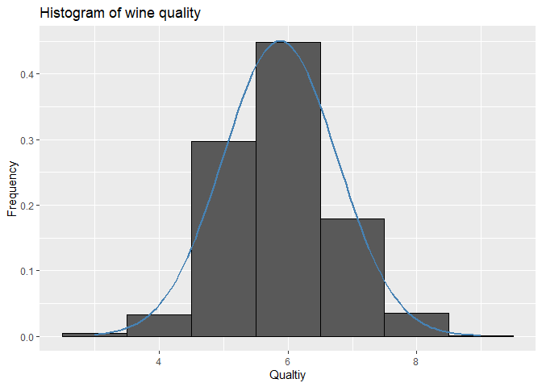

Introduction
------------

Winemaking is a challenging and competitive business that offers the
potential for great profit. However, there are numerous factors that
contribute to the profitability of a winery. As an agricultural product,
variables as diverse as the weather and the growing environment impact
the quality of a varietal. The bottling and manufacturing can also
affect the flavor for better or worse. Even the way the product is
marketed, from the bottle design to the price point, can affect the
customer’s perception of taste.

As a consequence, the winemaking industry has invested heavily in data
collection and machine learning methods that may assist with the
decision science of winemaking.

Collecting data
---------------

To develop the wine rating model, we will use data by P. Cortez, A.
Cerdeira, F. Almeida, T. Matos, and J. Reis. Their dataset includes
examples of red and white Vinho Verde wines from Portugal—one of the
world’s leading wine-producing countries. Because the factors that
contribute to a highly rated wine may differ between the red and white
varieties, for this analysis we will examine only the more popular white
wines.

The white wine data includes information on 11 chemical properties of
4,898 wine samples. For each wine, a laboratory analysis measured
characteristics such as the acidity, sugar content, chlorides, sulfur,
alcohol, pH, and density. The samples were then rated in a blind tasting
by panels of no less than three judges on a quality scale ranging from
zero (very bad) to 10 (excellent). In the case that the judges disagreed
on the rating, the median value was used.

For ease to acces the dataset I have hosted a public repository and
included the code that directly downloads the data from the repo and
loads the data. The path can be canged to anythig according to your
preference of the working directory.

    set.seed(6799)
    path <- "A:/Project/Quality_Wines"
    setwd(path)
    url <- "https://raw.githubusercontent.com/shreyaskhadse/data_files/master/whitewines.csv"
    datafile <- "./whitewines.csv"
    if (!file.exists(datafile)) {
        download.file(url, datafile ,method="auto") }
    wine <- read.csv("whitewines.csv")
    str(wine)

    ## 'data.frame':    4898 obs. of  12 variables:
    ##  $ fixed.acidity       : num  7 6.3 8.1 7.2 7.2 8.1 6.2 7 6.3 8.1 ...
    ##  $ volatile.acidity    : num  0.27 0.3 0.28 0.23 0.23 0.28 0.32 0.27 0.3 0.22 ...
    ##  $ citric.acid         : num  0.36 0.34 0.4 0.32 0.32 0.4 0.16 0.36 0.34 0.43 ...
    ##  $ residual.sugar      : num  20.7 1.6 6.9 8.5 8.5 6.9 7 20.7 1.6 1.5 ...
    ##  $ chlorides           : num  0.045 0.049 0.05 0.058 0.058 0.05 0.045 0.045 0.049 0.044 ...
    ##  $ free.sulfur.dioxide : num  45 14 30 47 47 30 30 45 14 28 ...
    ##  $ total.sulfur.dioxide: num  170 132 97 186 186 97 136 170 132 129 ...
    ##  $ density             : num  1.001 0.994 0.995 0.996 0.996 ...
    ##  $ pH                  : num  3 3.3 3.26 3.19 3.19 3.26 3.18 3 3.3 3.22 ...
    ##  $ sulphates           : num  0.45 0.49 0.44 0.4 0.4 0.44 0.47 0.45 0.49 0.45 ...
    ##  $ alcohol             : num  8.8 9.5 10.1 9.9 9.9 10.1 9.6 8.8 9.5 11 ...
    ##  $ quality             : int  6 6 6 6 6 6 6 6 6 6 ...

Exploring and Cleaning data
---------------------------

Compared with other types of machine learning models, one of the
advantages of trees is that they can handle many types of data without
preprocessing. This means we do not need to normalize or standardize the
features.

We now examine the distribution of the outcome variable is needed to
inform our evaluation of the model’s performance. For instance, suppose
that there was very little variation in quality from wine to wine, or
that wines fell into a bimodal distribution: either very good or very
bad. This may impact the way we design the model. To check for such
extremes, we can examine the distribution of wine quality using a
histogram:

    library(ggplot2)
    ggplot( wine, aes(x = quality))+geom_histogram(aes(y = ..density..), color = "black", binwidth = 1)+labs(title = "Histogram of wine quality", x = "Qualtiy", y = "Frequency") +
      stat_function(fun = dnorm, args = list(mean = mean(wine$quality),sd = sd(wine$quality)),col = "steelblue",size = 1)

The wine quality values appear to follow a fairly normal, bell-shaped
distribution, centered around a value of six. This makes sense
intuitively, because most wines are of average quality; few are
particularly bad or good.

Now we divide the dataset into training and testing sets. Since the wine
dataset was already sorted randomly, we can partition into two sets of
contiguous rows as follows:

    wine_train <- wine[1:3750,]
    wine_test <- wine[3751:4898,]

Training a model on the data
----------------------------

We will begin by training a regression tree model. Although almost any
implementation of decision trees can be used to perform regression tree
modeling, the `rpart` (recursive partitioning) package offers the most
faithful implementation of regression trees as they were described by
the CART team.

    #install.packages("rpart")
    library(rpart)

    ## Warning: package 'rpart' was built under R version 3.6.3

    m.rpart <- rpart(quality ~ ., data = wine_train)
    m.rpart

    ## n= 3750 
    ## 
    ## node), split, n, deviance, yval
    ##       * denotes terminal node
    ## 
    ##  1) root 3750 3140.06000 5.886933  
    ##    2) alcohol< 10.85 2473 1510.66200 5.609381  
    ##      4) volatile.acidity>=0.2425 1406  740.15080 5.402560  
    ##        8) volatile.acidity>=0.4225 182   92.99451 4.994505 *
    ##        9) volatile.acidity< 0.4225 1224  612.34560 5.463235 *
    ##      5) volatile.acidity< 0.2425 1067  631.12090 5.881912 *
    ##    3) alcohol>=10.85 1277 1069.95800 6.424432  
    ##      6) free.sulfur.dioxide< 11.5 93   99.18280 5.473118 *
    ##      7) free.sulfur.dioxide>=11.5 1184  879.99920 6.499155  
    ##       14) alcohol< 11.85 611  447.38130 6.296236 *
    ##       15) alcohol>=11.85 573  380.63180 6.715532 *

    summary(m.rpart)

    ## Call:
    ## rpart(formula = quality ~ ., data = wine_train)
    ##   n= 3750 
    ## 
    ##           CP nsplit rel error    xerror       xstd
    ## 1 0.17816211      0 1.0000000 1.0003885 0.02388913
    ## 2 0.04439109      1 0.8218379 0.8228001 0.02239105
    ## 3 0.02890893      2 0.7774468 0.7869521 0.02212401
    ## 4 0.01655575      3 0.7485379 0.7589200 0.02098057
    ## 5 0.01108600      4 0.7319821 0.7451423 0.02051570
    ## 6 0.01000000      5 0.7208961 0.7388191 0.02049181
    ## 
    ## Variable importance
    ##              alcohol              density            chlorides 
    ##                   38                   23                   12 
    ##     volatile.acidity total.sulfur.dioxide  free.sulfur.dioxide 
    ##                   12                    7                    6 
    ##            sulphates                   pH       residual.sugar 
    ##                    1                    1                    1 
    ## 
    ## Node number 1: 3750 observations,    complexity param=0.1781621
    ##   mean=5.886933, MSE=0.8373493 
    ##   left son=2 (2473 obs) right son=3 (1277 obs)
    ##   Primary splits:
    ##       alcohol              < 10.85    to the left,  improve=0.17816210, (0 missing)
    ##       density              < 0.992385 to the right, improve=0.11980970, (0 missing)
    ##       chlorides            < 0.0395   to the right, improve=0.08199995, (0 missing)
    ##       total.sulfur.dioxide < 153.5    to the right, improve=0.03875440, (0 missing)
    ##       free.sulfur.dioxide  < 11.75    to the left,  improve=0.03632119, (0 missing)
    ##   Surrogate splits:
    ##       density              < 0.99201  to the right, agree=0.869, adj=0.614, (0 split)
    ##       chlorides            < 0.0375   to the right, agree=0.773, adj=0.334, (0 split)
    ##       total.sulfur.dioxide < 102.5    to the right, agree=0.705, adj=0.132, (0 split)
    ##       sulphates            < 0.345    to the right, agree=0.670, adj=0.031, (0 split)
    ##       fixed.acidity        < 5.25     to the right, agree=0.662, adj=0.009, (0 split)
    ## 
    ## Node number 2: 2473 observations,    complexity param=0.04439109
    ##   mean=5.609381, MSE=0.6108623 
    ##   left son=4 (1406 obs) right son=5 (1067 obs)
    ##   Primary splits:
    ##       volatile.acidity    < 0.2425   to the right, improve=0.09227123, (0 missing)
    ##       free.sulfur.dioxide < 13.5     to the left,  improve=0.04177240, (0 missing)
    ##       alcohol             < 10.15    to the left,  improve=0.03313802, (0 missing)
    ##       citric.acid         < 0.205    to the left,  improve=0.02721200, (0 missing)
    ##       pH                  < 3.325    to the left,  improve=0.01860335, (0 missing)
    ##   Surrogate splits:
    ##       total.sulfur.dioxide < 111.5    to the right, agree=0.610, adj=0.097, (0 split)
    ##       pH                   < 3.295    to the left,  agree=0.598, adj=0.067, (0 split)
    ##       alcohol              < 10.05    to the left,  agree=0.590, adj=0.049, (0 split)
    ##       sulphates            < 0.715    to the left,  agree=0.584, adj=0.037, (0 split)
    ##       residual.sugar       < 1.85     to the right, agree=0.581, adj=0.029, (0 split)
    ## 
    ## Node number 3: 1277 observations,    complexity param=0.02890893
    ##   mean=6.424432, MSE=0.8378682 
    ##   left son=6 (93 obs) right son=7 (1184 obs)
    ##   Primary splits:
    ##       free.sulfur.dioxide  < 11.5     to the left,  improve=0.08484051, (0 missing)
    ##       alcohol              < 11.85    to the left,  improve=0.06149941, (0 missing)
    ##       fixed.acidity        < 7.35     to the right, improve=0.04259695, (0 missing)
    ##       residual.sugar       < 1.275    to the left,  improve=0.02795662, (0 missing)
    ##       total.sulfur.dioxide < 67.5     to the left,  improve=0.02541719, (0 missing)
    ##   Surrogate splits:
    ##       total.sulfur.dioxide < 48.5     to the left,  agree=0.937, adj=0.14, (0 split)
    ## 
    ## Node number 4: 1406 observations,    complexity param=0.011086
    ##   mean=5.40256, MSE=0.526423 
    ##   left son=8 (182 obs) right son=9 (1224 obs)
    ##   Primary splits:
    ##       volatile.acidity     < 0.4225   to the right, improve=0.04703189, (0 missing)
    ##       free.sulfur.dioxide  < 17.5     to the left,  improve=0.04607770, (0 missing)
    ##       total.sulfur.dioxide < 86.5     to the left,  improve=0.02894310, (0 missing)
    ##       alcohol              < 10.25    to the left,  improve=0.02890077, (0 missing)
    ##       chlorides            < 0.0455   to the right, improve=0.02096635, (0 missing)
    ##   Surrogate splits:
    ##       density       < 0.99107  to the left,  agree=0.874, adj=0.027, (0 split)
    ##       citric.acid   < 0.11     to the left,  agree=0.873, adj=0.022, (0 split)
    ##       fixed.acidity < 9.85     to the right, agree=0.873, adj=0.016, (0 split)
    ##       chlorides     < 0.206    to the right, agree=0.871, adj=0.005, (0 split)
    ## 
    ## Node number 5: 1067 observations
    ##   mean=5.881912, MSE=0.591491 
    ## 
    ## Node number 6: 93 observations
    ##   mean=5.473118, MSE=1.066482 
    ## 
    ## Node number 7: 1184 observations,    complexity param=0.01655575
    ##   mean=6.499155, MSE=0.7432425 
    ##   left son=14 (611 obs) right son=15 (573 obs)
    ##   Primary splits:
    ##       alcohol        < 11.85    to the left,  improve=0.05907511, (0 missing)
    ##       fixed.acidity  < 7.35     to the right, improve=0.04400660, (0 missing)
    ##       density        < 0.991395 to the right, improve=0.02522410, (0 missing)
    ##       residual.sugar < 1.225    to the left,  improve=0.02503936, (0 missing)
    ##       pH             < 3.245    to the left,  improve=0.02417936, (0 missing)
    ##   Surrogate splits:
    ##       density              < 0.991115 to the right, agree=0.710, adj=0.401, (0 split)
    ##       volatile.acidity     < 0.2675   to the left,  agree=0.665, adj=0.307, (0 split)
    ##       chlorides            < 0.0365   to the right, agree=0.631, adj=0.237, (0 split)
    ##       total.sulfur.dioxide < 126.5    to the right, agree=0.566, adj=0.103, (0 split)
    ##       residual.sugar       < 1.525    to the left,  agree=0.560, adj=0.091, (0 split)
    ## 
    ## Node number 8: 182 observations
    ##   mean=4.994505, MSE=0.5109588 
    ## 
    ## Node number 9: 1224 observations
    ##   mean=5.463235, MSE=0.5002823 
    ## 
    ## Node number 14: 611 observations
    ##   mean=6.296236, MSE=0.7322117 
    ## 
    ## Node number 15: 573 observations
    ##   mean=6.715532, MSE=0.6642788

`alcohol` has the highest importance as a predictor, followed by
`density`.

For each node in the tree, the number of examples reaching the decision
point is listed. For instance, all 3,750 examples begin at the root
node, of which 2,473 have `alcohol < 10.85` and 1,277 have
`alcohol >= 10.85`. Because alcohol was used first in the tree, it is
the single most important predictor of wine quality.

Nodes indicated by \* are terminal or leaf nodes, which means that they
result in a prediction (listed here as yval). For example, node 5 has a
`yval` of 5.881912. When the tree is used for predictions, any wine
samples with `alcohol < 10.85` and volatile.acidity &lt; 0.2425 would
therefore be predicted to have a quality value of 5.881912.

    #install.packages("rpart.plot")
    library(rpart.plot)

    ## Warning: package 'rpart.plot' was built under R version 3.6.3

    rpart.plot(m.rpart, digits = 3, box.palette = "BuGn")

    #rpart.plot(m.rpart, digits = 4, fallen.leaves = TRUE,type = 3, extra = 101)

Evaluating model performance
----------------------------

To use the regression tree model to make predictions on the test data,
we use the `predict()` function. By default, this returns the estimated
numeric value for the outcome variable, which we’ll save in a vector
named `p.rpart`:

    p.rpart <- predict(m.rpart, wine_test)
    "summary(p.part)"

    ## [1] "summary(p.part)"

    summary(p.rpart)

    ##    Min. 1st Qu.  Median    Mean 3rd Qu.    Max. 
    ##   4.995   5.463   5.882   5.999   6.296   6.716

    "summary(wine_test$quality)"

    ## [1] "summary(wine_test$quality)"

    summary(wine_test$quality)

    ##    Min. 1st Qu.  Median    Mean 3rd Qu.    Max. 
    ##   3.000   5.000   6.000   5.848   6.000   8.000

This finding suggests that the model is not correctly identifying the
extreme cases, in particular, the best and worst wines. On the other
hand, between the first and third quartile, we may be doing well.

The correlation between the predicted and actual quality values provides
a simple way to gauge the model’s performance.

    cor(p.rpart, wine_test$quality)

    ## [1] 0.4931608

A correlation of 0.49 is certainly acceptable. However, the correlation
only measures how strongly the predictions are related to the true
value; it is not a measure of how far off the predictions were from the
true values.

Another way to think about the model’s performance is to consider how
far, on average, its prediction was from the true value. This
measurement is called the mean absolute error (MAE).

    MAE <- function(actual, predicted) {mean(abs(actual - predicted))}
    MAE(p.rpart, wine_test$quality)

    ## [1] 0.5732104

This implies that, on average, the difference between our model’s
predictions and the true quality score was about 0.59. On a quality
scale from zero to 10, this seems to suggest that our model is doing
fairly well.

On the other hand, recall that most wines were neither very good nor
very bad; the typical quality score was around five to six. Therefore, a
classifier that did nothing but predict the mean value may still do
fairly well according to this metric.

The mean quality rating in the training data is as follows:

    mean(wine_train$quality)

    ## [1] 5.886933

If we predicted the value 5.89 for every wine sample, we would have a
mean absolute error of only about 0.58:

    MAE(5.87, wine_test$quality)

    ## [1] 0.5815679

Our regression tree (MAE = 0.57) comes closer on average to the true
quality score than the imputed mean (MAE = 0.58), but not by much. In
comparison, Cortez reported an MAE of 0.58 for the neural network model
and an MAE of 0.45 for the support vector machine. This suggests that
there is room for improvement.

Improving model performance
---------------------------

To improve the performance of our learner, let’s apply a model tree
algorithm, which is a more complex application of trees to numeric
prediction.A model tree extends regression trees by replacing the leaf
nodes with regression models. This often results in more accurate
results than regression trees, which use only a single numeric value for
the prediction at the leaf nodes.

The current state-of-the-art in model trees is the Cubist algorithm,
which itself is an enhancement of the M5 model tree algorithm. The
Cubist algorithm involves building a decision tree, creating decision
rules based on the branches of the tree, and building a regression model
at each of the leaf nodes. Additional heuristics, such as pruning and
boosting, are used to improve the quality of the predictions and
smoothness across the range of predicted values.

    #install.packages("Cubist")
    library(Cubist)

    ## Warning: package 'Cubist' was built under R version 3.6.3

    ## Loading required package: lattice

    m.cubist <- cubist(x = wine_train[-12], y = wine_train$quality)
    m.cubist

    ## 
    ## Call:
    ## cubist.default(x = wine_train[-12], y = wine_train$quality)
    ## 
    ## Number of samples: 3750 
    ## Number of predictors: 11 
    ## 
    ## Number of committees: 1 
    ## Number of rules: 10

    summary(m.cubist)

    ## 
    ## Call:
    ## cubist.default(x = wine_train[-12], y = wine_train$quality)
    ## 
    ## 
    ## Cubist [Release 2.07 GPL Edition]  Wed Aug 25 10:45:52 2021
    ## ---------------------------------
    ## 
    ##     Target attribute `outcome'
    ## 
    ## Read 3750 cases (12 attributes) from undefined.data
    ## 
    ## Model:
    ## 
    ##   Rule 1: [918 cases, mean 5.3, range 3 to 7, est err 0.5]
    ## 
    ##     if
    ##  volatile.acidity > 0.26
    ##  alcohol <= 10.2
    ##     then
    ##  outcome = 66.6 + 0.187 alcohol + 0.041 residual.sugar - 65 density
    ##            - 1.38 volatile.acidity + 0.5 pH + 0.0028 free.sulfur.dioxide
    ## 
    ##   Rule 2: [177 cases, mean 5.5, range 4 to 8, est err 0.5]
    ## 
    ##     if
    ##  citric.acid > 0.42
    ##  residual.sugar <= 14.05
    ##  free.sulfur.dioxide > 49
    ##     then
    ##  outcome = 32.5 + 0.379 alcohol - 0.024 residual.sugar - 31 density
    ##            - 0.54 volatile.acidity + 0.15 sulphates
    ##            + 0.0003 total.sulfur.dioxide + 0.07 pH + 0.4 chlorides
    ##            + 0.01 fixed.acidity
    ## 
    ##   Rule 3: [490 cases, mean 5.7, range 3 to 8, est err 0.5]
    ## 
    ##     if
    ##  volatile.acidity <= 0.26
    ##  residual.sugar <= 12.75
    ##  free.sulfur.dioxide <= 49
    ##  alcohol <= 10.2
    ##     then
    ##  outcome = 253.6 - 252 density + 0.102 residual.sugar
    ##            - 2.63 volatile.acidity + 0.0149 free.sulfur.dioxide
    ##            + 1.27 sulphates + 0.52 pH + 0.012 alcohol
    ## 
    ##   Rule 4: [71 cases, mean 5.8, range 5 to 7, est err 0.4]
    ## 
    ##     if
    ##  fixed.acidity <= 7.5
    ##  volatile.acidity <= 0.26
    ##  residual.sugar > 14.05
    ##  alcohol > 9.1
    ##     then
    ##  outcome = 127.2 - 125 density + 0.055 residual.sugar
    ##            - 2.47 volatile.acidity + 0.24 fixed.acidity + 0.67 sulphates
    ##            + 0.0017 total.sulfur.dioxide + 1.8 chlorides + 0.23 pH
    ##            - 0.0015 free.sulfur.dioxide + 0.013 alcohol
    ## 
    ##   Rule 5: [446 cases, mean 5.8, range 3 to 9, est err 0.5]
    ## 
    ##     if
    ##  citric.acid <= 0.42
    ##  residual.sugar <= 14.05
    ##  free.sulfur.dioxide > 49
    ##     then
    ##  outcome = 29.6 + 0.372 alcohol + 2.81 citric.acid
    ##            - 2.94 volatile.acidity - 28 density + 0.013 residual.sugar
    ##            + 0.13 sulphates + 0.0003 total.sulfur.dioxide
    ##            + 0.01 fixed.acidity
    ## 
    ##   Rule 6: [451 cases, mean 5.9, range 3 to 8, est err 0.7]
    ## 
    ##     if
    ##  free.sulfur.dioxide <= 20
    ##  alcohol > 10.2
    ##     then
    ##  outcome = 16.2 + 0.0537 free.sulfur.dioxide + 0.311 alcohol
    ##            - 2.63 volatile.acidity + 0.037 residual.sugar
    ##            - 0.2 fixed.acidity - 13 density + 0.08 pH
    ## 
    ##   Rule 7: [113 cases, mean 5.9, range 5 to 7, est err 0.5]
    ## 
    ##     if
    ##  fixed.acidity <= 7.5
    ##  volatile.acidity <= 0.26
    ##  residual.sugar > 14.05
    ##  alcohol <= 9.1
    ##     then
    ##  outcome = -8.3 + 2.204 alcohol - 0.143 residual.sugar
    ##            + 0.0066 total.sulfur.dioxide - 1.65 sulphates
    ##            - 0.0092 free.sulfur.dioxide - 3 density
    ## 
    ##   Rule 8: [35 cases, mean 6.2, range 3 to 8, est err 0.8]
    ## 
    ##     if
    ##  fixed.acidity > 7.5
    ##  volatile.acidity <= 0.26
    ##  residual.sugar > 14.05
    ##  alcohol <= 10.2
    ##     then
    ##  outcome = 29.5 - 0.451 residual.sugar - 19.04 volatile.acidity
    ##            - 0.804 alcohol - 39.4 chlorides + 0.0127 total.sulfur.dioxide
    ##            - 0.64 fixed.acidity
    ## 
    ##   Rule 9: [46 cases, mean 6.3, range 5 to 7, est err 0.4]
    ## 
    ##     if
    ##  volatile.acidity <= 0.26
    ##  residual.sugar > 12.75
    ##  residual.sugar <= 14.05
    ##  free.sulfur.dioxide <= 49
    ##  alcohol <= 10.2
    ##     then
    ##  outcome = 11.9 - 13.32 volatile.acidity + 0.0216 total.sulfur.dioxide
    ##            - 8.01 sulphates - 0.0521 free.sulfur.dioxide - 16.2 chlorides
    ## 
    ##   Rule 10: [1410 cases, mean 6.4, range 3 to 9, est err 0.6]
    ## 
    ##     if
    ##  free.sulfur.dioxide > 20
    ##  alcohol > 10.2
    ##     then
    ##  outcome = 247.3 - 250 density + 0.11 residual.sugar + 1.26 pH
    ##            + 0.116 alcohol + 1.04 sulphates + 0.11 fixed.acidity
    ##            - 0.26 volatile.acidity + 0.0012 free.sulfur.dioxide
    ## 
    ## 
    ## Evaluation on training data (3750 cases):
    ## 
    ##     Average  |error|                0.4
    ##     Relative |error|               0.63
    ##     Correlation coefficient        0.67
    ## 
    ## 
    ##  Attribute usage:
    ##    Conds  Model
    ## 
    ##     85%    99%    alcohol
    ##     73%    84%    free.sulfur.dioxide
    ##     40%    97%    volatile.acidity
    ##     33%    99%    residual.sugar
    ##     15%    11%    citric.acid
    ##      5%    62%    fixed.acidity
    ##            98%    density
    ##            85%    pH
    ##            66%    sulphates
    ##            21%    total.sulfur.dioxide
    ##             8%    chlorides
    ## 
    ## 
    ## Time: 0.3 secs

In this output, we see that the algorithm generated 10 rules to model
the wine quality.

You will note that the `if` portion of the output is somewhat similar to
the regression tree we built earlier. A series of decisions based on the
wine properties of sulfur dioxide, sulphates, and alcohol creates a rule
culminating in the final prediction. A key difference between this model
tree output and the earlier regression tree output, however, is that the
nodes here terminate not in a numeric prediction, but rather a linear
model.

The linear model for this rule is shown in the then output following the
`outcome = statement`

To examine the performance of this model, we’ll look at how well it
performs on the unseen test data. The predict() function gets us a
vector of predicted values:

    p.cubist <- predict(m.cubist, wine_test)
    summary(p.cubist)

    ##    Min. 1st Qu.  Median    Mean 3rd Qu.    Max. 
    ##   3.315   5.574   6.093   6.028   6.437   7.647

The correlation also seems to be substantially higher:

    "cor()"

    ## [1] "cor()"

    cor(p.cubist, wine_test$quality)

    ## [1] 0.5683117

    "MAE"

    ## [1] "MAE"

    MAE(wine_test$quality, p.cubist)

    ## [1] 0.5306253

Although we did not improve a great deal beyond the regression tree, we
surpassed the performance of the neural network model published by
Cortez, and we are getting closer to the published mean absolute error
value of 0.45 for the support vector machine model, all while using a
much simpler learning method.
