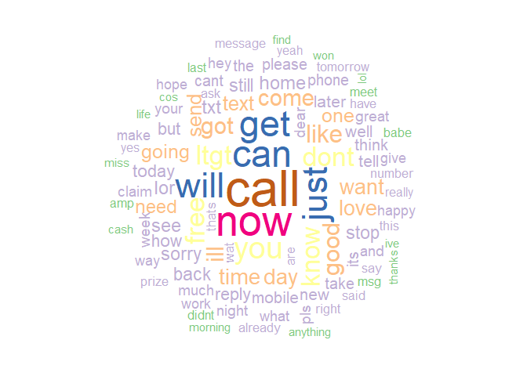
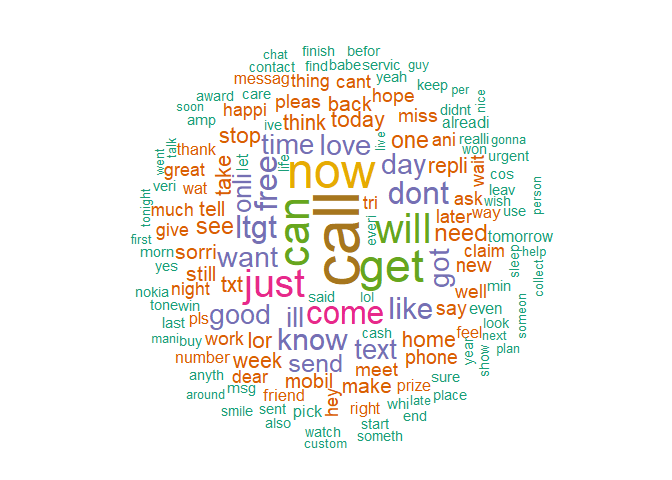
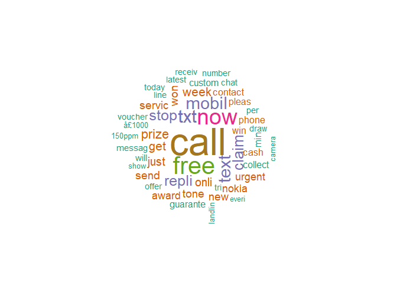
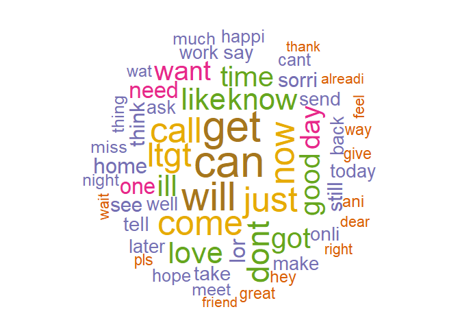

Introduction
------------

Short Message Service (SMS) is used to send short text messages from one
mobile device to another. This service is a very popular type of
communication between people. However, not all SMS messages are
solicited - mobile users receive legitimate messages and unwanted
messages that are called spam.

Now the reason why we want to classify the spam/ham messages is the need
to be organized so that when we wish to seek information we can access
it conveniently. While classifying we are more concerned about the ham
messages that are falsely classified as spam, and not the other way
around, as if we get a spam message in the ham folder we can ignore it
or say report it as spam which would make the model better, but if a ham
message ends up in the spam folder, it may lead to the loss of critical
information which can be harmful.

Naive Bayes
-----------

Naive Bayes is a simple technique for constructing classifier models
that assign class labels to problem instances, represented as vectors of
feature values, where the class labels are drawn from some finite set.
There is not a single algorithm for training such classifiers, but a
family of algorithms based on a common principle: all naive Bayes
classifiers assume that the value of a particular feature is independent
of the value of any other feature, given the class variable. For
example, a fruit may be considered to be an apple if it is red, round,
and about 10 cm in diameter. A naive Bayes classifier considers each of
these features to contribute independently to the probability that this
fruit is an apple, regardless of any possible correlations between the
color, roundness, and diameter features.

For some types of probability models, naive Bayes classifiers can be
trained very efficiently in a supervised learning setting. In many
practical applications, parameter estimation for naive Bayes models uses
the method of maximum likelihood; in other words, one can work with the
naive Bayes model without accepting Bayesian probability or using any
Bayesian methods.

Despite their naive design and apparently oversimplified assumptions,
naive Bayes classifiers have worked quite well in many complex
real-world situations. In 2004, an analysis of the Bayesian
classification problem showed that there are sound theoretical reasons
for the apparently implausible efficacy of naive Bayes
classifiers.Still, a comprehensive comparison with other classification
algorithms in 2006 showed that Bayes classification is outperformed by
other approaches, such as boosted trees or random forests.

An advantage of naive Bayes is that it only requires a small number of
training data to estimate the parameters necessary for classification.

*To know more about why exactly we used the Naive Bayes Classifyer,
there is a very nice explaination regarding this on YouTube which can be
accessed by [clicking
here](https://www.youtube.com/watch?v=O2L2Uv9pdDA).*

Data Source
-----------

To develope the SPAM/HAM classifier using the Naive Bayes model we will
use the data that is made publically available on the [UCI Machine
Learning
Repository](https://archive.ics.uci.edu/ml/datasets/SMS+Spam+Collection).
You can download the exact version of dataset used in this study from
[here](https://drive.google.com/file/d/1Pp0Yz0AmCgHXBrdNO9b_0ZDAhBE6aQHU/view?usp=sharing).
This dataset comprises of two variables: -*type*: This variable
classifies if the other variable is spam/ham. It should be used as a
factor variable. -*text*: This variable has the text sms as strings.

The dataset contains 5572 observations.

### Sample SMS ham

-   Better. Made up for Friday and stuffed myself like a pig yesterday.
    Now I feel bleh. But, at least, its not writhing pain kind of bleh.
-   If he started searching, he will get job in few days. He has great
    potential and talent.
-   I got another job! The one at the hospital, doing data analysis or
    something, starts on Monday! Not sure when my thesis will finish.

### Sample SMS spam

-   Congratulations ur awarded 500 of CD vouchers or 125 gift guaranteed
    & Free entry 2 100 wkly draw txt MUSIC to 87066.
-   December only! Had your mobile 11mths+? You are entitled to update
    to the latest colour camera mobile for Free! Call The Mobile Update
    Co FREE on 08002986906.
-   Valentines Day Special! Win over £1000 in our quiz and take your
    partner on the trip of a lifetime! Send GO to 83600 now. 150 p/msg
    rcvd.

Looking at the preceding messages, did you notice any distinguishing
characteristics of spam? One notable characteristic is that two of the
three spam messages use the word “free,” yet the word does not appear in
any of the ham messages. On the other hand, two of the ham messages cite
specific days of the week, as compared to zero in spam messages.

Our Naive Bayes classifier will take advantage of such patterns in the
word frequency to determine whether the SMS messages seem to better fit
the profile of spam or ham. While it’s not inconceivable that the word
“free” would appear outside of a spam SMS, a legitimate message is
likely to provide additional words explaining the context. For instance,
a ham message might state “are you free on Sunday?” Whereas, a spam
message might use the phrase “free ringtones.” The classifier will
compute the probability of spam and ham, given the evidence provided by
all the words in the message.

Data Loading and Exploration
----------------------------

We now proceed by setting up the environment. We first set the seed,
even if we are not generating any random data, it is a good practice to
follow as it helps in making our research reproducible. We now set the
working directory where our dataset is located. Inmy case it was
“A:/Project/Spam\_SMS”. Read the data using the “read.csv” command and
save it into a dataframe which we have named as ‘spamhamdataset’. When
the dataset is loaded we can see that the variables are read as ‘factor’
type so we then typecast the ‘text’ variable ‘as.character’. We generate
the wordcloud to just take a look at the various words that are there in
the text variable, with the size of the the word in the cloud
proportional to its frequency.

Using the str() function, we see that the sms\_raw data frame includes
5,572 total SMS messages with two features: type and text. The SMS type
has been coded as either ham or spam. The text element stores the full
raw SMS text.

    set.seed(1234)    #Setting seed
    setwd("A:/Project/Spam_SMS")    #Setting working directory
    spamhamdataset <- read.csv("A:/Project/Spam_SMS/spamhamdataset.csv")    #Reading the .csv dataset
    spamhamdataset$text <- as.character(spamhamdataset$text)    #Typecasting the 'text' variable as character
    str(spamhamdataset)   #Short summary of the dataset

    ## 'data.frame':    5572 obs. of  2 variables:
    ##  $ type: Factor w/ 2 levels "ham","spam": 1 1 2 1 1 2 1 1 2 2 ...
    ##  $ text: chr  "Go until jurong point, crazy.. Available only in bugis n great world la e buffet... Cine there got amore wat..." "Ok lar... Joking wif u oni..." "Free entry in 2 a wkly comp to win FA Cup final tkts 21st May 2005. Text FA to 87121 to receive entry question("| __truncated__ "U dun say so early hor... U c already then say..." ...

    library(wordcloud)      #For making wordcloud

    ## Warning: package 'wordcloud' was built under R version 3.6.3

    ## Loading required package: RColorBrewer

    wordcloud(spamhamdataset$text, max.words = 100, random.order = FALSE, colors = brewer.pal(7, "Accent"))   #Making a wordcloud

    ## Loading required namespace: tm

    ## Warning in tm_map.SimpleCorpus(corpus, tm::removePunctuation): transformation
    ## drops documents

    ## Warning in tm_map.SimpleCorpus(corpus, function(x) tm::removeWords(x,
    ## tm::stopwords())): transformation drops documents

The word cloud that we see above are the words from the whole
unprocessed dataset. We can see that some words such as ‘are’, ‘this’,
‘its’ have been frequent in the document, but this add little to no
value in our categorization of the spam/ham sms. We will take care of
this in druing the text processing segement.

We will now take a look at the proportion of the spam and the ham sms in
our dataset.

    prop.table(table(spamhamdataset$type))    #Making a proportional table

    ## 
    ##       ham      spam 
    ## 0.8659368 0.1340632

We can observe that the dataset comprises of around **86.5% ham text
sms** and around **13.5% spam text sms**.

Packages
--------

**tm** package: A framework for text mining applications within R. We
will use this package to process our text variable.  
**SnowballC** package: An R interface to the C ‘libstemmer’ library that
implements Porter’s word stemming algorithm for collapsing words to a
common root to aid comparison of vocabulary.

The procedure that we are following comes under ‘Natural Language
Processing’ (NLP)

    library(tm)           #For Text Mining

    ## Warning: package 'tm' was built under R version 3.6.3

    ## Loading required package: NLP

    ## Warning: package 'NLP' was built under R version 3.6.3

    library(SnowballC)    #For Text Processing

    ## Warning: package 'SnowballC' was built under R version 3.6.3

**wordcloud** package: Functionality to create pretty word clouds,
visualize differences and similarity between documents, and avoid
over-plotting in scatter plots with text.  
**RColorBrewer** package: Provides color schemes for maps (and other
graphics) designed by Cynthia Brewer as described at
<a href="http://colorbrewer2.org" class="uri">http://colorbrewer2.org</a>

    library(wordcloud)      #For making wordcloud
    library(RColorBrewer)   #For makin the wordclod colorfull

**e1071** package: Functions for latent class analysis, short time
Fourier transform, fuzzy clustering, support vector machines, shortest
path computation, bagged clustering, naive Bayes classifier, …  
**caret** package: Misc functions for training and plotting
classification and regression models.

    library(e1071)         #For Naive Bayes

    ## Warning: package 'e1071' was built under R version 3.6.3

    library(caret)         #For the Confusion Matrix

    ## Warning: package 'caret' was built under R version 3.6.3

    ## Loading required package: lattice

    ## Loading required package: ggplot2

    ## 
    ## Attaching package: 'ggplot2'

    ## The following object is masked from 'package:NLP':
    ## 
    ##     annotate

Data Preprocessing
------------------

We use 2 functions here: The VectorSource() function will create one
document for each sms text message. And the Vcorpus() function to create
a volatile corpus from these individual text messages.  
Once we create the corpus( a corpus is a collection of text documents),
we will clean up the data by removing numbers, converting to lowercase,
removing punctuation, removing stopwords and applying stemming(involves
trimming words suchs calling, called and calls to call).

    sms_corpus = VCorpus(VectorSource(spamhamdataset$text))
    as.character(sms_corpus[[1]])

    ## [1] "Go until jurong point, crazy.. Available only in bugis n great world la e buffet... Cine there got amore wat..."

To walk you through what text processing we are doing, I have generated
the output after every transformation so that you can see what is going
on behind the hood.

*To Lowercase Transformation*

    corpus_clean = tm_map(sms_corpus, content_transformer(tolower))
    as.character(corpus_clean[[1]])

    ## [1] "go until jurong point, crazy.. available only in bugis n great world la e buffet... cine there got amore wat..."

*Remove Punctuation Transformation*

    corpus_clean = tm_map(corpus_clean, removePunctuation)
    as.character(corpus_clean[[1]])

    ## [1] "go until jurong point crazy available only in bugis n great world la e buffet cine there got amore wat"

*Stem Document Tranformation*

    corpus_clean = tm_map(corpus_clean, stemDocument)
    as.character(corpus_clean[[1]])

    ## [1] "go until jurong point crazi avail onli in bugi n great world la e buffet cine there got amor wat"

*Remove Stopwords Transformation*

    corpus_clean = tm_map(corpus_clean, removeWords, stopwords("en"))
    as.character(corpus_clean[[1]])

    ## [1] "go  jurong point crazi avail onli  bugi n great world la e buffet cine  got amor wat"

Now that the data are processed to our liking, the final step is to
split the messages into individual components through a process called
tokenization. A token is a single element of a text string; in this
case, the tokens are words.

As you might assume, the tm package provides functionality to tokenize
the SMS message corpus. The DocumentTermMatrix() function will take a
corpus and create a data structure called a Document Term Matrix (DTM)
in which rows indicate documents (SMS messages) and columns indicate
terms (words).

Creating a DTM sparse matrix, given a tm corpus, involves a single
command:

    sms_dtm <- DocumentTermMatrix(corpus_clean)

This will create an sms\_dtm object that contains the tokenized corpus
using the default settings, which apply minimal processing. The default
settings are appropriate because we have already prepared the corpus
manually.

On the other hand, if we hadn’t performed the preprocessing, we could do
so here by providing a list of control parameter options to override the
defaults. For example, to create a DTM directly from the raw,
unprocessed SMS corpus, we can use the following command:

    sms_dtm <- DocumentTermMatrix(sms_corpus, control = list(
      tolower = TRUE,
      removeNumbers = TRUE, 
      removePunctuation = TRUE, 
      stemming = TRUE, 
      stopwords = TRUE))
    sms_dtm

    ## <<DocumentTermMatrix (documents: 5572, terms: 6885)>>
    ## Non-/sparse entries: 43883/38319337
    ## Sparsity           : 100%
    ## Maximal term length: 40
    ## Weighting          : term frequency (tf)

This applies the same preprocessing steps to the SMS corpus in the same
order as done earlier.

Now we have processed corpus, we are now left with the *bag of words*.
At first, using the bag of words instead of literal sentences sounds
absurd, that what would just some random words will be able to
determine. But, this is the beauty of *Naive Bayes* that factor gets
controlled for, since we are applying the transformation to the whole
dataset and not just some subset.

Now, lets make the wordcloud again, after the text processing (natural
language processing) has been performed. This step is completely
optional but is suggested as we get to visualize what is going on. First
we create the dataset back from the processed corpus:

    reverse_sms <- data.frame(text = sapply(corpus_clean, as.character), stringsAsFactors = FALSE, type = spamhamdataset$type)

Then we proceed to create the wordcloud of the whole dataset (and not
just the spam or ham subsets):

    wordcloud(reverse_sms$text, max.words = 150, colors = brewer.pal(7, "Dark2"), random.order = FALSE)

    ## Warning in tm_map.SimpleCorpus(corpus, tm::removePunctuation): transformation
    ## drops documents

    ## Warning in tm_map.SimpleCorpus(corpus, function(x) tm::removeWords(x,
    ## tm::stopwords())): transformation drops documents

Now, we create the wordcloud of just the spam subset data:

    spam <- subset(reverse_sms, type == "spam")
    wordcloud(spam$text, max.words =50, colors = brewer.pal(7, "Dark2"), random.order = FALSE)

    ## Warning in tm_map.SimpleCorpus(corpus, tm::removePunctuation): transformation
    ## drops documents

    ## Warning in tm_map.SimpleCorpus(corpus, function(x) tm::removeWords(x,
    ## tm::stopwords())): transformation drops documents

Okay, here we can clearly see that the spam bag of words has words such
as - ‘call’, ‘free’, ‘urgent’, etc. as the most frequent words. And we
as a humand can also judge an sms by the occurence of such words in the
text. Thus, we can literally see that our ‘machine’ is ‘learning’, (you
get it what I was trying to do? nvm XD).

Next, we do the same for the ham subset of data and create the
wordcloud:

    ham <- subset(reverse_sms, type == "ham")
    wordcloud(ham$text, max.words = 60, colors = brewer.pal(7, "Dark2"), random.order = FALSE)

    ## Warning in tm_map.SimpleCorpus(corpus, tm::removePunctuation): transformation
    ## drops documents

    ## Warning in tm_map.SimpleCorpus(corpus, function(x) tm::removeWords(x,
    ## tm::stopwords())): transformation drops documents

So, taking a look at the ham wordcloud we can see that the most frequent
words are - ‘can’, ‘will’, ‘come’, ‘good’, etc. These words together
build up a legitimate message.

Splitting the data
------------------

With our data prepared for analysis, we now need to split the data into
training and test datasets, so that once our spam classifier is built,
it can be evaluated on data it has not previously seen. But even though
we need to keep the classifier blinded as to the contents of the test
dataset, it is important that the split occurs after the data have been
cleaned and processed; we need exactly the same preparation steps to
occur on both the training and test datasets.

We’ll divide the data into two portions: 80 percent for training and 20
percent for testing. Since the SMS messages are sorted in a random
order, we can simply take the first 4457 for training and leave the
remaining 1115 for testing. Thankfully, the DTM object acts very much
like a data frame and can be split using the standard \[row, col\]
operations. As our DTM stores SMS messages as rows and words as columns,
we must request a specific range of rows and all columns for each:

    #Training & Test set
    sms_dtm_train <- sms_dtm[1:4457, ]
    sms_dtm_test <- sms_dtm[4458:5572, ]

For convenience later on, it is also helpful to save a pair of vectors
with labels for each of the rows in the training and testing matrices.
These labels are not stored in the DTM, so we would need to pull them
from the original sms\_raw data frame:

    #Training & Test Label
    sms_train_labels <- spamhamdataset[1:4457, ]$type
    sms_test_labels <- spamhamdataset[4458:5572, ]$type

To confirm that the subsets are representative of the complete set of
SMS data, let’s compare the proportion of spam in the training and test
data frames:

    #Proportion for training & test labels
    prop.table(table(sms_train_labels))

    ## sms_train_labels
    ##       ham      spam 
    ## 0.8649316 0.1350684

    prop.table(table(sms_test_labels))

    ## sms_test_labels
    ##       ham      spam 
    ## 0.8699552 0.1300448

Both the training data and test data contain about 13 percent spam. This
suggests that the spam messages were divided evenly between the two
datasets.

Trimming the data
-----------------

The final step in the data preparation process is to transform the
sparse matrix into a data structure that can be used to train a Naive
Bayes classifier. Currently, the sparse matrix includes over 6,500
features; this is a feature for every word that appears in at least one
SMS message. It’s unlikely that all of these are useful for
classification. To reduce the number of features, we will eliminate any
word that appear in less than five SMS messages, or in less than about
0.1 percent of the records in the training data.

Finding frequent words requires use of the findFreqTerms() function in
the tm package. This function takes a DTM and returns a character vector
containing the words that appear for at least the specified number of
times. For instance, the following command will display the words
appearing at least five times in the sms\_dtm\_train matrix:

    threshold <- 0.1

    min_freq = round(sms_dtm$nrow*(threshold/100),0)

    min_freq

    ## [1] 6

    # Create vector of most frequent words
    freq_words <- findFreqTerms(x = sms_dtm, lowfreq = min_freq)

    str(freq_words)

    ##  chr [1:1246] "‰ûò" "abiola" "abl" "abt" "accept" "access" "account" ...

We now need to filter our DTM to include only the terms appearing in a
specified vector. As done earlier, we’ll use the data frame style \[row,
col\] operations to request specific portions of the DTM, noting that
the columns are named after the words the DTM contains. We can take
advantage of this to limit the DTM to specific words. Since we want all
the rows, but only the columns representing the words in the
sms\_freq\_words vector, our commands are:

    #Filter the DTM
    sms_dtm_freq_train <- sms_dtm_train[ , freq_words]
    sms_dtm_freq_test <- sms_dtm_test[ , freq_words]

    dim(sms_dtm_freq_train)

    ## [1] 4457 1246

    dim(sms_dtm_freq_test)

    ## [1] 1115 1246

The training and test datasets now include 1,246 features, which
correspond to words appearing in at least five messages.

The Naive Bayes classifier is typically trained on data with categorical
features. This poses a problem, since the cells in the sparse matrix are
numeric and measure the number of times a word appears in a message. We
need to change this to a categorical variable that simply indicates yes
or no depending on whether the word appears at all.

The following defines a convert\_counts() function to convert counts to
Yes/No strings:

    convert_values <- function(x) {
      x <- ifelse(x > 0, "Yes", "No")
    }

By now, some of the pieces of the preceding function should look
familiar. The first line defines the function. The ifelse(x &gt; 0,
“Yes”, “No”) statement transforms the values in x, so that if the value
is greater than 0, then it will be replaced by “Yes”, otherwise it will
be replaced by a “No” string. Lastly, the newly transformed x vector is
returned.

We now need to apply convert\_counts() to each of the columns in our
sparse matrix. You may be able to guess the R function to do exactly
this. The function is simply called apply() and is used much like
lapply() was used previously.

The apply() function allows a function to be used on each of the rows or
columns in a matrix. It uses a MARGIN parameter to specify either rows
or columns. Here, we’ll use MARGIN = 2, since we’re interested in the
columns (MARGIN = 1 is used for rows). The commands to convert the
training and test matrices are as follows:

    sms_train <- apply(sms_dtm_freq_train, MARGIN = 2,
                       convert_values)
    sms_test <- apply(sms_dtm_freq_test, MARGIN = 2,
                      convert_values)

The result will be two character type matrixes, each with cells
indicating “Yes” or “No” for whether the word represented by the column
appears at any point in the message represented by the row.

Training the Naive Bayes model
------------------------------

Now that we have transformed the raw SMS messages into a format that can
be represented by a statistical model, it is time to apply the Naive
Bayes algorithm. The algorithm will use the presence or absence of words
to estimate the probability that a given SMS message is spam.

The Naive Bayes implementation we will employ is in the e1071 package.
This package was developed in the statistics department of the Vienna
University of Technology (TU Wien), and includes a variety of functions
for machine learning.

    #Create model from the training dataset
    sms_classifier <- naiveBayes(sms_train, sms_train_labels)

The sms\_classifier object now contains a naiveBayes classifier object
that can be used to make predictions.

Evaluating the model performance
--------------------------------

To evaluate the SMS classifier, we need to test its predictions on
unseen messages in the test data. Recall that the unseen message
features are stored in a matrix named sms\_test, while the class labels
(spam or ham) are stored in a vector named sms\_test\_labels. The
classifier that we trained has been named sms\_classifier. We will use
this classifier to generate predictions and then compare the predicted
values to the true values.

The predict() function is used to make the predictions. We will store
these in a vector named sms\_test\_pred. We will simply supply the
function with the names of our classifier and test dataset, as shown:

    #Make predictions on test set
    sms_test_pred <- predict(sms_classifier, sms_test)

Now that we are done with the prediction, we will now compare the
predicted labels with the original test dataset labels. To do so, we
will us the ‘Confusion Matrix’ which gives us a nice little summary of
our comparison. Given below is the command:

    #Create confusion matrix
    confusionMatrix(data = sms_test_pred, reference = sms_test_labels,
                    positive = "spam", dnn = c("Prediction", "Actual"))

    ## Confusion Matrix and Statistics
    ## 
    ##           Actual
    ## Prediction ham spam
    ##       ham  964   16
    ##       spam   6  129
    ##                                           
    ##                Accuracy : 0.9803          
    ##                  95% CI : (0.9703, 0.9876)
    ##     No Information Rate : 0.87            
    ##     P-Value [Acc > NIR] : < 2e-16         
    ##                                           
    ##                   Kappa : 0.9102          
    ##                                           
    ##  Mcnemar's Test P-Value : 0.05501         
    ##                                           
    ##             Sensitivity : 0.8897          
    ##             Specificity : 0.9938          
    ##          Pos Pred Value : 0.9556          
    ##          Neg Pred Value : 0.9837          
    ##              Prevalence : 0.1300          
    ##          Detection Rate : 0.1157          
    ##    Detection Prevalence : 0.1211          
    ##       Balanced Accuracy : 0.9417          
    ##                                           
    ##        'Positive' Class : spam            
    ## 

We see that we get a decent accuracy of 98.03% ! The model missed 6 spam
messages and wrongly classified them as ham.

Summary
-------

The Naive Bayes model works on the assumption that the features of the
dataset are independent of each other — hence called Naive. This works
well for bag-of-words models a.k.a text documents since: - words in a
text document are independent of each other. - the location of one word
doesn’t depend on another word. Thus satisfying the independence
assumption of the Naive Bayes model. Hence, it is most commonly used for
text classification, sentiment analysis, spam filtering & recommendation
systems.
